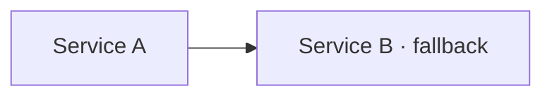

# Microservices Interview Guide

A scenario-based interview preparation guide covering microservices architecture, resilience patterns, service communication, observability, and distributed systems design.

## 📖 Overview

This is an MkDocs-based documentation site organized into 7 topic sections with collapsible, interview-ready Q&A covering microservices from resilience fundamentals to advanced patterns.

### Topic Sections

#### Fundamentals
| # | Section | Topics |
|---|---------|--------|
| 1 | **Resilience & Fault Tolerance** | Circuit breakers, bulkheads, fallbacks, partial failures |
| 2 | **Service Communication** | Retries, idempotency, gRPC, API Gateway, service mesh |

#### Scalability & Data
| # | Section | Topics |
|---|---------|--------|
| 3 | **Performance & Scalability** | Latency, bottlenecks, auto-scaling, load distribution |
| 4 | **Data Consistency** | Saga pattern, event deduplication, eventual consistency |

#### Operations
| # | Section | Topics |
|---|---------|--------|
| 5 | **Observability & Debugging** | Distributed tracing, centralized logging, metrics |
| 6 | **Deployment & Compatibility** | API versioning, canary deployments, feature flags |

#### Architect Level
| # | Section | Topics |
|---|---------|--------|
| 7 | **Advanced Patterns** | CQRS, event sourcing, async APIs, saga orchestration |
| 8 | **Security & Resilience4j** | OAuth2, JWT, mTLS, Spring Cloud Gateway, circuit breaker config |
| 9 | **Spring Cloud & Frameworks** | WebClient, Feign, Config Server, Actuator probes |
| 10 | **Containers & Kubernetes** | Docker best practices, K8s deployment, secrets, service mesh |
| 11 | **Architecture & Design Patterns** | Strangler Fig, BFF, Sidecar, Outbox pattern, DDD decomposition |
| 12 | **CI/CD & Team Leadership** | Pipelines, monolith migration, incident handling, tech debt |

---

## 🚀 Getting Started

### Prerequisites

- Python 3.7+
- pip (Python package manager)

### Installation


2. **Create a virtual environment:**
```bash
python3 -m venv .venv
source .venv/bin/activate
```

3. **Install dependencies:**
```bash
pip install -r requirements.txt
```

---

## 💻 Running the Site

### Local Development Server

```bash
python3 -m mkdocs serve
```

Open your browser to: **http://localhost:8000**

The site will automatically reload when you make changes to markdown files.

### Build Static Site

```bash
python3 -m mkdocs build
```

Output is generated in the `site/` directory.

---

## 📁 Project Structure

```
microservicesInterview/
├── mkdocs.yml                           # Site configuration
├── requirements.txt                     # Python dependencies
├── README.md                            # This file
├── docs/
│   ├── index.md                         # Home page + topic map
│   ├── glossary.md                      # Glossary reference
│   ├── _abbreviations.md                # Term definitions for tooltips
│   ├── css/
│   │   └── extra.css                    # Custom styles
│   ├── js/
│   │   ├── mathjax.js                   # Math rendering config
│   │   ├── mermaid-init.js              # Diagram rendering
│   │   ├── theme-toggle.js              # Dark/light theme toggle
│   │   └── abbr-tooltip.js              # Abbreviation tooltips
│   └── interview/
│       ├── 01-microservices-resilience.md
│       ├── 02-service-communication.md
│       ├── 03-performance-scalability.md
│       ├── 04-data-consistency.md
│       ├── 05-observability.md
│       ├── 06-deployment-compatibility.md
│       └── 07-advanced-patterns.md
├── site/                                # Generated static site (do not edit)
└── .venv/                               # Python virtual environment
```

---

## ✨ Features

### 🎨 Theme & Design
- **Material Design** theme with light/dark mode toggle
- Responsive layout for desktop and mobile
- Syntax highlighting for code blocks
- Mermaid architecture diagrams

### 📚 Content Format
- **Collapsible interview questions** (`??? question` blocks) — click to expand
- **Scenario-based questions**: *"Your system does X. How will you handle it?"*
- **Concise answers**: 2–5 lines, interview-ready
- **Hover tooltips** for microservices terms

### 🔍 Abbreviations & Tooltips

Key microservices terms have hover tooltips:
- **API, gRPC, REST** — communication protocols
- **SLA, SLO, SLI** — reliability targets
- **CQRS, Saga, 2PC** — distributed patterns
- And more in `docs/_abbreviations.md`

---

## 📝 Writing Content

### Adding a New Topic File

1. Create `docs/interview/NN-topic-name.md`
2. Use the article template:

```markdown
# Topic Name — Microservices Interview

> **Level:** Intermediate · Advanced

---

## Section Heading

??? question "Your system does X. How will you handle it?"
    Answer in 2–5 lines.

---

## Diagram



--8<-- "_abbreviations.md"
```

3. Add entry to `mkdocs.yml` under the appropriate nav section.

### Key Rules

- ✅ Always leave a blank line before lists
- ✅ End every file with `--8<-- "_abbreviations.md"`
- ✅ Use `·` instead of `|` in Mermaid node labels
- ✅ Include at least one Mermaid diagram per file
- ✅ Group questions under `## Section Heading` headings
- ❌ Never remove existing questions

---

## 🛠️ Configuration

### mkdocs.yml

```yaml
theme:
  name: material
  palette:
    - scheme: default      # Light mode
    - scheme: slate        # Dark mode

markdown_extensions:
  - abbr                   # Abbreviation support
  - pymdownx.snippets      # Include snippets (--8<--)
  - pymdownx.superfences   # Code blocks & diagrams
  - pymdownx.details       # Collapsible ??? question blocks
```

### requirements.txt

```
mkdocs>=1.5.0
mkdocs-material>=9.5.0
pymdown-extensions>=10.8
Markdown>=3.6
```

---

## 🔧 Troubleshooting

### Server Won't Start
```bash
source .venv/bin/activate
pip install -r requirements.txt
python3 -m mkdocs serve
```

### Abbreviations Not Showing
- Verify `--8<-- "_abbreviations.md"` is at the end of every article
- Check that `pymdownx.snippets` is in `mkdocs.yml`
- Rebuild: `python3 -m mkdocs build`

### Mermaid Diagrams Not Rendering
- Never use `|` in node labels — use `·` instead
- Check `docs/js/mermaid-init.js` is listed in `mkdocs.yml` extra_javascript

---

## 📋 Checklist for New Content

Before pushing to Git:

- [ ] File is placed in `docs/interview/` with correct numbering
- [ ] Title uses format: `# Topic — Microservices Interview`
- [ ] Questions use `??? question "..."` collapsible blocks
- [ ] At least one Mermaid diagram included
- [ ] `--8<-- "_abbreviations.md"` footer present
- [ ] No `|` characters in Mermaid labels (use `·` instead)
- [ ] Blank line before all lists
- [ ] File added to `mkdocs.yml` nav
- [ ] Build succeeds: `python3 -m mkdocs build`

---

## 📚 Resources

- **MkDocs:** https://www.mkdocs.org/
- **Material for MkDocs:** https://squidfunk.github.io/mkdocs-material/
- **PyMdown Extensions:** https://facelessuser.github.io/pymdown-extensions/
- **Mermaid Diagrams:** https://mermaid.js.org/

---

**Happy interviewing! 🎓**
