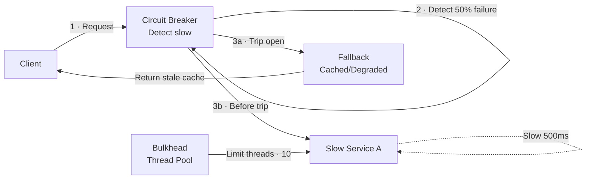
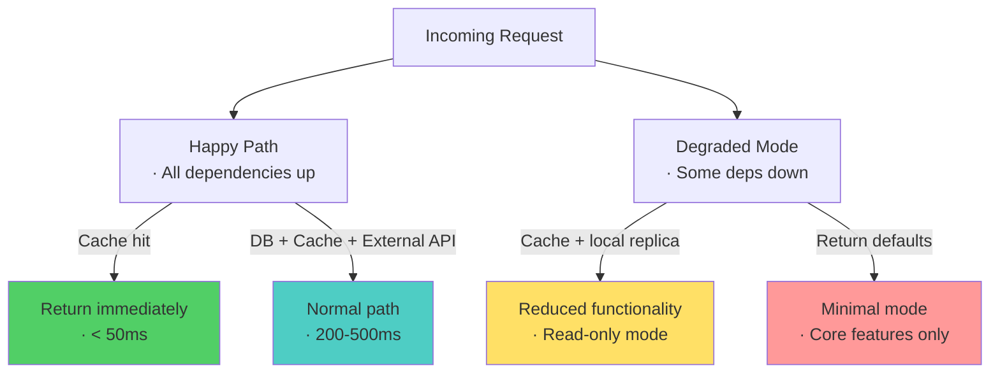
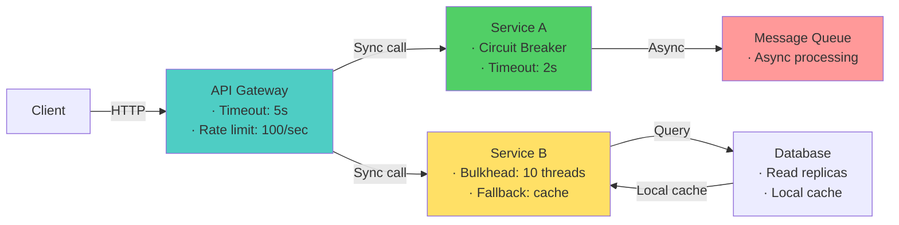

# Microservices & Spring Interview Questions

> **Level:** Intermediate to Advanced


---

# Resilience & Fault Tolerance — Microservices Interview

> **Target:** Senior Engineer · Engineering Lead · Pre-Architect
> **Focus:** Circuit breakers, bulkheads, fallbacks, cascading failures, resilience patterns

---

## Q: A microservice becomes slow and starts impacting all dependent services. How do you prevent cascading failures?

*Why interviewers ask this:* Cascading failures are one of the most costly production incidents. Tests understanding of failure isolation and early detection.

### Answer

When Service A gets slow, all clients of Service A wait longer → their timeouts expire → they retry → more load on Service A → even slower → cascading across the entire system.

**Prevention strategy:**



**Multi-layer defense:**

| Layer | Tool | Mechanism |
|-------|------|-----------|
| **Circuit Breaker** | Resilience4j, Hystrix | Detect slow svc, fail fast, prevent retry storms |
| **Timeout** | Spring RestTemplate | Don't wait forever — kill request after Nth ms |
| **Bulkhead** | Thread pool isolation | Limit threads per downstream svc — prevent pool exhaustion |
| **Rate Limiter** | Resilience4j | Cap requests to failing service, protect its recovery |
| **Fallback** | Custom logic | Return cached/stale data instead of error |

**Spring Boot implementation:**

```java
@Service
public class OrderClient {

    @CircuitBreaker(name = "orderService", fallbackMethod = "orderFallback")
    @Retry(name = "orderService", fallbackMethod = "orderFallback")
    @Bulkhead(name = "orderService")
    @TimeLimiter(name = "orderService")
    public CompletableFuture<Order> getOrder(String orderId) {
        return CompletableFuture.supplyAsync(() ->
            webClient.get()
                .uri("/orders/{id}", orderId)
                .retrieve()
                .bodyToMono(Order.class)
                .block()  // blocking for simplicity
        );
    }

    public CompletableFuture<Order> orderFallback(String orderId, Exception e) {
        log.warn("OrderService slow/down, returning cached", e);
        return CompletableFuture.completedFuture(orderCache.get(orderId));
    }
}
```

**Configuration:**

```yaml
resilience4j:
  circuitbreaker:
    instances:
      orderService:
        slidingWindowSize: 10          # Watch last 10 calls
        failureRateThreshold: 50       # Open if 50% fail
        waitDurationInOpenState: 10s   # Wait before half-open

  timelimiter:
    instances:
      orderService:
        timeoutDuration: 2s            # Kill after 2 sec

  bulkhead:
    instances:
      orderService:
        maxThreadPoolSize: 10          # Max 10 parallel threads
```

!!! tip "Architect Insight"
    Circuit breaker isn't about preventing failures — it's about **detecting failures early and failing fast** before cascading. A 500ms timeout that keeps the service alive is better than a 30-second timeout that suffocates the entire system.

---

## Q: How do you design fallback mechanisms for high-latency dependencies?

### Answer

A **fallback** is a backup behavior when the primary operation fails or times out. Design fallbacks as a hierarchy:

```
Fallback hierarchy (try in order):
1. Cached/stale data (best UX — might be slightly outdated)
2. Partial results (reduced functionality, not zero value)
3. Default value (safe but degraded)
4. Error to user (last resort)
```

**Examples:**

| Service | Fallback Strategy |
|---------|------------------|
| Product Catalog | Serve stale cached products (from Redis) |
| Recommendation | Return empty list (user sees less personalization) |
| Payment | Queue for async processing, notify user of delay |
| User Profile | Use cached/default values, disable personalized features |
| Search | Fallback to simple DB query (slower but works) |

**Implementation:**

```java
public ProductInfo getProductWithFallback(String productId) {
    try {
        return catalogServiceClient.getProduct(productId);  // 500ms timeout
    } catch (TimeoutException e) {
        // Try cache first
        Optional<ProductInfo> cached = cache.get(productId);
        if (cached.isPresent()) {
            log.warn("Catalog timeout, serving cached product", e);
            return cached.get();
        }
        // Cache miss — return degraded response
        log.warn("Catalog timeout and cache miss, returning defaults");
        return ProductInfo.degraded(productId);
    }
}
```

!!! warning "Common Mistake"
    Don't use fallbacks for **all** errors indiscriminately. Fallback to stale product data = OK. Fallback to stale payment status = TERRIBLE (wrong balance). Know which failures can safely degrade.

---

## Q: A downstream service becomes unavailable frequently. How do you ensure resilience?

### Answer

If a service fails often, you need **health-aware routing** + **automatic failover** + **messaging-based decoupling**.

**Strategies:**

```
Unavailable service?
├─ Active-active (multiple instances)
│  ├─ Health checks → route away from failing instance
│  └─ Load balancer removes unhealthy from pool
├─ Read replicas (read-only)
│  ├─ Use read-only replica if primary down
│  └─ Trade: eventual consistency
├─ Async + queuing
│  ├─ Don't call synchronously
│  ├─ Queue work, process when service is back
│  └─ Service becomes optional for happy path
└─ Multi-region failover
   ├─ Primary region down → fail to secondary
   └─ Trade: latency, cost, complexity
```

**Kubernetes example — health checks:**

```yaml
apiVersion: apps/v1
kind: Deployment
metadata:
  name: inventory-service
spec:
  replicas: 3  # Multiple instances
  template:
    spec:
      containers:

        - name: inventory
          livenessProbe:
            httpGet:
              path: /health/liveness
              port: 8080
            failureThreshold: 3
            periodSeconds: 10
            # After 3 failures = restart this pod
          readinessProbe:
            httpGet:
              path: /health/readiness
              port: 8080
            failureThreshold: 2
            periodSeconds: 5
            # After 2 failures = remove from load balancer
```

---

## Q: How do you design for high availability when dependencies fail?

### Answer

Design the service to **degrade gracefully**, not fail completely:



**Key tactics:**

1. **Local cache** — keep recent data locally; use if upstream is down
2. **Read replicas** — maintain a local copy of critical data
3. **Async queuing** — don't block on slow operations
4. **Feature flags** — disable non-critical features when downstream is down
5. **Bulkheads** — isolation ensures one slow service doesn't block others

---

## Q: How do you ensure idempotency across distributed calls?

### Answer

**Idempotency** = calling the same operation multiple times produces the same result as once. Critical for safe retries in distributed systems.

**Three levels:**

| Level | Implementation | Example |
|-------|---|---|
| **Client** | Generate UUID for each logical operation | `Idempotency-Key: 550e8400...` header |
| **Network** | Retry framework transparently resends | Resilience4j, gRPC built-in retries |
| **Server** | Detect duplicates, return cached result | Check idempotency key in DB before processing |

**Flow:**

```
Client sends: POST /payments?Idempotency-Key=UUID-1
Server processes → stores result → returns response
Network timeout → Client retries same request
Server: "Key UUID-1 already processed" → returns cached result
Result: Payment processed once, not twice ✓
```

**Spring implementation:**

```java
@PostMapping("/payments")
public PaymentResponse processPayment(
    @RequestBody PaymentRequest req,
    @RequestHeader("Idempotency-Key") String key) {
    
    // Step 1: Check if already processed
    Optional<PaymentResponse> cached = idempotencyStore.get(key);
    if (cached.isPresent()) {
        return cached.get();
    }
    
    // Step 2: Process and store result atomically
    PaymentResponse response = paymentGateway.charge(req.amount);
    idempotencyStore.put(key, response);
    
    return response;
}
```

---

## Q: How do you handle partial failures gracefully?

### Answer

A batch operation might succeed partially (3 of 5 items process, 2 fail). Design to handle this:

**API Design:**

```json
POST /orders/batch
[
  {id: 1, qty: 5},
  {id: 2, qty: 3},
  {id: 3, qty: 7}
]

Response: 207 Multi-Status
{
  "succeeded": [
    {id: 1, orderId: "ORD-123"}
  ],
  "failed": [
    {id: 2, reason: "Out of stock"},
    {id: 3, reason: "Invalid quantity"}
  ]
}
```

**Implementation:**

```java
@PostMapping("/orders/batch")
public ResponseEntity<BatchResponse> createOrdersBatch(@RequestBody List<OrderRequest> requests) {
    BatchResponse response = new BatchResponse();
    
    for (OrderRequest req : requests) {
        try {
            Order order = orderService.createOrder(req);
            response.addSuccess(order);
        } catch (OutOfStockException e) {
            response.addFailure(req.id, e.getMessage());
        }
    }
    
    return ResponseEntity
        .status(response.hasFailures() ? HttpStatus.MULTI_STATUS : HttpStatus.OK)
        .body(response);
}
```

---

## Diagram — Complete Resilience Architecture



--8<-- "_abbreviations.md"
