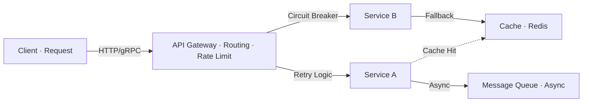

# Service Communication — Microservices Interview

> **Level:** Intermediate to Advanced
> **Section:** [Microservices Interview Guide](../index.md)

---

## Inter-Service Communication & Reliability

Ensuring inter-service calls are reliable, efficient, and properly handled.

??? question "Inter-service communication fails intermittently. How will you ensure reliability?"
    Use retry mechanisms with exponential backoff and jitter. Implement timeouts to prevent hanging requests. Use circuit breakers for failing services. Implement idempotency keys to safely retry requests. Use service mesh for resilient communication. Add comprehensive logging and distributed tracing. Monitor network latency and packet loss.

??? question "Inter-service communication causes network overhead. How will you optimize it?"
    Use efficient serialization formats (Protocol Buffers instead of JSON for internal APIs). Implement caching at gateway and service level. Use HTTP/2 for multiplexing. Batch requests where possible. Use async messaging for non-real-time requirements. Consider gRPC for high-performance inter-service communication. Implement connection pooling. Use CDNs for static content.

??? question "You observe duplicate requests due to retries. How will you ensure idempotency?"
    Implement idempotency keys (unique request IDs) at the client level. Design handler methods to be idempotent — reprocessing with the same input produces the same result. Use database unique constraints or conditional writes. Store idempotency keys with results for a window of time. Implement at-most-once processing semantics in message handlers. Use transaction IDs across distributed calls.

??? question "A downstream service returns incorrect data with a success status. How will you handle it?"
    Implement validation at the consumer level — never trust the response format or content. Use schema validation (OpenAPI, Protobuf schemas). Implement circuit breakers that detect data quality issues. Add canary deployments with validation checks. Implement data freshness checks. Use observability to detect anomalies in response patterns. Design compensating transactions to handle bad data.

??? question "API Gateway becomes a bottleneck handling too many requests. How will you optimize?"
    Implement horizontal scaling with load balancing. Use async processing in the gateway. Optimize routing logic and caching. Implement rate limiting to prevent overload. Use connection pooling. Cache responses at the gateway level. Consider splitting into multiple gateways by business domain. Use CDN for static content. Offload TLS termination to a load balancer.

---

## gRPC vs REST Trade-offs

Choosing the right communication protocol for different scenarios.

??? question "When should you use gRPC over REST?"
    Use gRPC for high-throughput, low-latency internal service communication. gRPC uses HTTP/2 multiplexing and Protocol Buffers for efficient serialization. REST is better for public APIs and browser clients. gRPC supports bidirectional streaming and is more efficient for microservices. However, REST is simpler to debug and has broader ecosystem support. Consider complexity trade-offs before choosing gRPC.

??? question "How do you handle versioning in service-to-service communication?"
    Use backward-compatible field additions in Protocol Buffers or JSON schemas. Design APIs to ignore unknown fields. Implement API versioning through URL paths or headers. Support multiple API versions simultaneously during transitions. Use feature flags for gradual rollouts. Test compatibility between old and new service versions. Document deprecation timelines clearly.

---

## Service Mesh & Communication Patterns

Managing communication patterns at scale.

??? question "Should you implement a service mesh (Istio, Linkerd) in your architecture?"
    Service mesh provides resilience patterns (retries, circuit breakers), load balancing, and observability without code changes. Useful for large microservices deployments (10+ services). Trade-off: adds operational complexity and performance overhead. Start with libraries (Hystrix, Resilience4j) first. Move to service mesh when you have many services and need unified policies. Consider managed service mesh to reduce operational burden.

??? question "How do you implement request tracing across service boundaries?"
    Propagate trace IDs and span IDs in request headers (X-Trace-ID, X-Span-ID). Use libraries like Spring Cloud Sleuth to automatically add tracing. Instrument HTTP calls, message queues, and database queries. Send traces to a central system (Jaeger, Zipkin, DataDog). Sample traces intelligently (1-10%) to avoid overhead. Create dashboards showing request latency and error rates by service.

---

## Diagram

--8<-- "_abbreviations.md"

