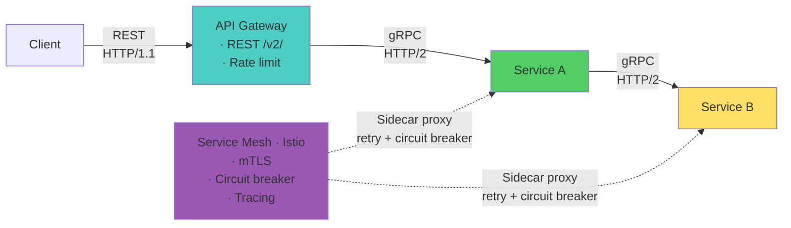

# Service Communication — Microservices Interview

> **Target:** Senior Engineer · Engineering Lead · Pre-Architect
> **Focus:** gRPC vs REST, reliability patterns, API versioning, service mesh

---

## Q: How do you ensure reliable inter-service communication with retries and timeouts?

*Why interviewers ask this:* Network failures are inevitable. Tests understanding of timeout strategies, exponential backoff, and when retries are safe.

### Answer

**The problem:** Networks are unreliable. A 99.9% reliable service calling 10 services = 99% overall reliability (all succeed). Each retry risks cascading failures.

**Solution hierarchy:**

```
Failure handling order:
1. Timeout — don't wait forever (2-5 sec typical)
2. Detect failure → fast-fail
3. Retry with backoff (exponential: 100ms → 200ms → 400ms)
4. Circuit breaker — stop retrying if service is down
5. Fallback — return degraded response
```

**Spring Boot example:**

```java
@Service
public class PaymentClient {

    @Retry(name = "payment", fallbackMethod = "paymentFallback")
    @CircuitBreaker(name = "payment")
    @TimeLimiter(name = "payment")
    public CompletableFuture<PaymentResponse> charge(PaymentRequest req) {
        return CompletableFuture.supplyAsync(() ->
            webClient.post()
                .uri("http://payment-service/charge")
                .bodyValue(req)
                .retrieve()
                .bodyToMono(PaymentResponse.class)
                .timeout(Duration.ofSeconds(2))
                .block()
        );
    }

    public CompletableFuture<PaymentResponse> paymentFallback(
            PaymentRequest req, Exception ex) {
        // Return degraded response
        return CompletableFuture.completedFuture(
            PaymentResponse.pending(req.orderId)
        );
    }
}
```

**Configuration:**

```yaml
resilience4j:
  retry:
    instances:
      payment:
        max-attempts: 3
        wait-duration: 100ms
        exponential-backoff-multiplier: 2
        retry-exceptions:
          - java.net.ConnectException
          - java.io.IOException

  timelimiter:
    instances:
      payment:
        timeout-duration: 2s
```

**Backoff strategy:**
```
Attempt 1: immediate
Attempt 2: wait 100ms
Attempt 3: wait 200ms
Total max wait: 300ms before failing
```

!!! warning "Common Mistake"
    Retry on **any** exception = disaster. `SocketTimeoutException` → safe to retry. `PaymentAlreadyProcessedException` → fail immediately. Design idempotent operations before enabling retries on mutations.

---

## Q: When should you use gRPC vs REST for inter-service communication?

*Why interviewers ask this:* Tech choice has cascading implications for performance, debugging, and team expertise. Tests architectural trade-off thinking.

### Answer

| Criteria | REST | gRPC |
|----------|------|------|
| **Serialization** | JSON (text) | Protocol Buffers (binary) |
| **Size** | Large (~200 bytes) | Small (~50 bytes) — 4x smaller |
| **Speed** | Slower parsing | Fast binary parsing |
| **Protocol** | HTTP/1.1 (one request at a time) | HTTP/2 (multiplexed) |
| **Streaming** | No native support | Bidirectional streaming |
| **Debugging** | Easy (curl, browser) | Harder (need grpcurl) |
| **Ecosystem** | Mature, widely supported | Growing but less mature |
| **Browser clients** | ✅ Native | ❌ Requires gRPC-Web proxy |
| **Use case** | Public APIs, third-party clients | Internal service-to-service |

**Performance comparison:**

```
Service A → Service B (processing 10,000 requests)

REST:
- Request size: 200 bytes × 10k = 2 MB
- Response size: 300 bytes × 10k = 3 MB
- Total: 5 MB over network
- Latency: ~50 ms per request (JSON parsing)

gRPC:
- Request size: 50 bytes × 10k = 500 KB
- Response size: 75 bytes × 10k = 750 KB
- Total: 1.25 MB over network (-75%)
- Latency: ~5 ms per request (binary parsing, HTTP/2)
- 10x faster per request
```

**gRPC service definition:**

```protobuf
syntax = "proto3";

service OrderService {
  rpc GetOrder(OrderId) returns (Order);
  rpc CreateOrder(OrderRequest) returns (OrderResponse);
  // Bidirectional streaming
  rpc ProcessOrders(stream Order) returns (stream OrderStatus);
}

message Order {
  string id = 1;
  int64 amount = 2;
  string status = 3;
}
```

**gRPC + Spring Boot:**

```java
@GrpcService
public class OrderServiceImpl extends OrderServiceGrpc.OrderServiceImplBase {

    @Override
    public void getOrder(OrderId request, 
                        StreamObserver<Order> responseObserver) {
        Order order = orderService.findById(request.getId());
        responseObserver.onNext(order);
        responseObserver.onCompleted();
    }
}
```

**Recommendation:**
- **Use REST** — Public APIs, third-party clients, simplicity required
- **Use gRPC** — Internal service-to-service (10+ services), high throughput, streaming needs
- **Hybrid** — REST for edge (API Gateway) → gRPC internally

---

## Q: How do you implement API versioning without breaking clients?

### Answer

**Three versioning strategies:**

| Strategy | Example | Pros | Cons |
|----------|---------|------|------|
| **URL path** | `/v1/orders`, `/v2/orders` | Explicit, works with proxies | Duplicate code, routing complexity |
| **Header** | `Accept: application/json; version=2` | Single codebase, clean URLs | Less discoverable, cache issues |
| **Query param** | `/orders?api_version=2` | Flexible, easy to test | Cache-key issues, non-standard |

**Best practice — URL path with header fallback:**

```java
@RestController
@RequestMapping("/api")
public class OrderController {

    @GetMapping(
        "/v1/orders/{id}",
        produces = "application/json"
    )
    public OrderV1 getOrderV1(@PathVariable String id) {
        Order order = orderService.findById(id);
        // Map internal model to V1 (no new fields)
        return OrderV1.from(order);
    }

    @GetMapping(
        "/v2/orders/{id}",
        produces = "application/json"
    )
    public OrderV2 getOrderV2(@PathVariable String id) {
        Order order = orderService.findById(id);
        // Map to V2 (includes new fields, e.g., "estimatedDelivery")
        return OrderV2.from(order);
    }
}
```

**API evolution best practices:**

1. **Add fields, never remove** — Old clients ignore unknown fields
2. **Default old fields** — Always include fields from V1 in V2
3. **Deprecation timeline** — Announce 6–12 months before retiring API version
4. **Semantic versioning** — MAJOR.MINOR.PATCH (v1, v2, v1.1)

**Deprecation example:**

```
2024-01: Release /v2/orders (new field: tracking_id)
2025-01: Announce deprecation of /v1/orders
2025-07: Retire /v1/orders (clients must migrate)
```

---

## Q: Should you implement a service mesh (Istio, Linkerd)?

*Why interviewers ask this:* Service mesh is a major operational investment. Tests cost/benefit thinking and maturity assessment.

### Answer

**Service mesh = sidecar proxies + control plane** that handle:
- Retries, circuit breaking, timeouts (without code changes)
- Load balancing, traffic splitting (canary deployments)
- mTLS encryption between all services
- Distributed tracing, observability

**Decision matrix:**

| Organization Stage | Use Service Mesh? | Why |
|-------------------|------------------|-----|
| **< 5 microservices** | ❌ No | Overkill — use libraries (Resilience4j) |
| **5-20 microservices** | ⚠️ Maybe | Only if you have Kubernetes + experienced ops team |
| **20-50 microservices** | ✅ Yes | Centralized policy enforcement pays off |
| **50+ microservices** | ✅ Definitely | Manual resilience in each service becomes unmaintainable |

**Tradeoffs:**

| Aspect | Pro | Con |
|--------|-----|-----|
| **Resilience** | Automatic circuit breakers, retries in proxy | Added complexity, learning curve |
| **Observability** | Automatic tracing, metrics without code changes | More infrastructure to operate |
| **Overhead** | Centralized policy, no library duplication | ~10% latency penalty, memory per pod |
| **Debugging** | Flow is visible in mesh | More tools to learn (istioctl) |

**Recommendation:**
- **Start with** Resilience4j libraries (simpler, less overhead)
- **Migrate to service mesh** when you have 15+ services AND a dedicated platform team
- **Use managed service mesh** (AWS App Mesh, Google Anthos) to reduce operational burden

---

## Diagram — Complete Service Communication Architecture



--8<-- "_abbreviations.md"
