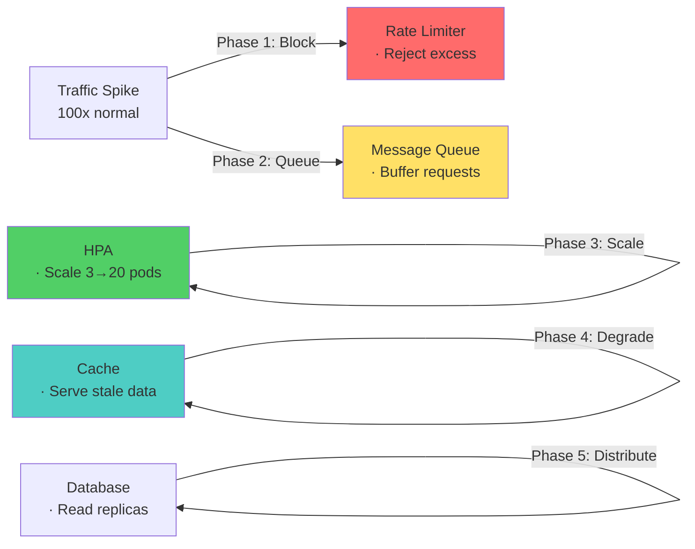

# Performance & Scalability — Microservices Interview

> **Target:** Senior Engineer · Engineering Lead · Pre-Architect
> **Focus:** Bottleneck diagnosis, auto-scaling, latency optimization, caching

---

## Q: Your system shows high latency only during peak hours. How do you identify the bottleneck?

*Why interviewers ask this:* Production latency issues are complex. Tests your ability to methodically diagnose across layers (network, service, database, JVM).

### Answer

**Diagnosis pyramid** (test from top down):

```
Network latency (1-10ms)?
  ↓ DNS, TCP handshake, TLS
Service latency (10-100ms)?
  ↓ Handler logic, serialization
Database latency (50-500ms)?
  ↓ Query time, locks, I/O
JVM overhead (5-50ms)?
  ↓ GC pauses, thread contention
```

**Tools & metrics:**

| Layer | Tool | Metric |
|-------|------|--------|
| **End-to-end** | Distributed tracing (Jaeger) | p50, p95, p99 latency per service |
| **Database** | Slow query log, EXPLAIN PLAN | Query time, lock waits |
| **JVM** | `-XX:+PrintGCDetails` | GC pause duration, frequency |
| **System** | `top`, `iostat`, `netstat` | CPU, memory, disk I/O, network |
| **Thread pool** | Spring Boot Actuator | Active threads, queue depth |

**Spring Boot diagnostic code:**

```java
@RestController
public class DiagnosticController {

    @GetMapping("/api/orders/{id}")
    public Order getOrder(@PathVariable String id) {
        long start = System.nanoTime();
        
        try {
            // Database call — measure separately
            long dbStart = System.nanoTime();
            Order order = orderRepository.findById(id).orElseThrow();
            long dbTime = System.nanoTime() - dbStart;
            
            log.info("Order lookup: {}ms", dbTime / 1_000_000);
            return order;
        } finally {
            long total = System.nanoTime() - start;
            log.info("Total latency: {}ms", total / 1_000_000);
        }
    }
}
```

**Peak hours diagnosis checklist:**

- [ ] Distributed trace shows which service is slow
- [ ] Database slow query log identifies problematic queries
- [ ] `jstat -gc` shows if GC pauses spike during load
- [ ] Thread pool metrics show saturation (queue_depth > 0)
- [ ] Network latency within expected range (< 50ms)

---

## Q: You notice uneven load distribution across instances. What could be wrong?

### Answer

**Load balancer issues:**

| Problem | Sign | Fix |
|---------|------|-----|
| **Sticky sessions misconfigured** | Some instances get 80% traffic | Remove session affinity or use shared session store (Redis) |
| **Health check failing** | Healthy instance marked down | Verify `/health` endpoint is working |
| **Round-robin only** | No awareness of instance load | Switch to least-connections or weighted algorithm |
| **DNS caching** | Requests go to old instance | Reduce DNS TTL, use service discovery |
| **Colocation** | Instances on same physical host | Check infrastructure layout, spread replicas |

**Kubernetes load balancing example:**

```yaml
apiVersion: v1
kind: Service
metadata:
  name: order-service
spec:
  selector:
    app: order-service
  type: ClusterIP
  sessionAffinity: None  # Disable sticky sessions
  sessionAffinityConfig:
    clientIP:
      timeoutSeconds: 10800
  ports:
    - port: 80
      targetPort: 8080
  loadBalancerAlgorithm: leastconn  # Use least-connections
```

**Monitoring:**

```
Per-instance metrics:
- Instance A: 50% CPU, 8K req/sec
- Instance B: 25% CPU, 4K req/sec ← Uneven!
- Instance C: 75% CPU, 12K req/sec

Action: Check if Instance B is slow, remove from pool, rebalance
```

---

## Q: A database becomes the bottleneck. How do you optimize?

### Answer

**Optimization hierarchy:**

```
1. Query optimization
   - Add indexes, use EXPLAIN
   - Avoid N+1 queries
   - Batch operations

2. Caching
   - Redis for hot data
   - Cache-aside pattern
   - Invalidation strategy

3. Read replicas
   - Offload reads to read-only followers
   - Trade consistency for throughput

4. Sharding
   - Partition by tenant or key
   - Requires app-level routing
```

**Query optimization checklist:**

```sql
-- BEFORE (slow):
SELECT o.* FROM orders o
WHERE o.customer_id = ?;
-- No index → table scan

-- AFTER (fast):
CREATE INDEX idx_orders_customer_id ON orders(customer_id);
-- Now uses index → O(log N)

-- EXPLAIN shows:
Index Seek (good) vs Table Scan (bad)
```

**Caching pattern:**

```java
@Cacheable(value = "products", key = "#productId")
public Product getProduct(String productId) {
    // Only called if cache miss
    return productRepository.findById(productId).orElseThrow();
}

@CacheEvict(value = "products", key = "#productId")
public void updateProduct(String productId, Product update) {
    productRepository.save(update);
}
```

**Read replica routing:**

```java
@Repository
public class OrderRepository {
    
    // Write to primary
    public Order save(Order order) {
        return primaryDataSource.save(order);
    }
    
    // Read from replica
    public Optional<Order> findById(String id) {
        return replicaDataSource.findById(id);
    }
}
```

---

## Q: A sudden traffic spike crashes services. How do you scale and stabilize?

### Answer

**Multi-layer response:**

```
Spike detected (CPU > 80%, errors rising)?
├─ Immediate (< 1 sec)
│  ├─ Rate limiting: reject new requests
│  ├─ Load shedding: drop low-priority traffic
│  └─ Circuit breaker: stop calling failing services
├─ Short-term (10-60 sec)
│  ├─ Auto-scaling: spin up new pods
│  ├─ Message queue: buffer requests
│  └─ Cache: serve stale data
└─ Long-term (> 1 min)
   ├─ Database optimization
   ├─ Code profiling & optimization
   └─ Infrastructure changes
```

**Kubernetes auto-scaling:**

```yaml
apiVersion: autoscaling/v2
kind: HorizontalPodAutoscaler
metadata:
  name: order-service-hpa
spec:
  scaleTargetRef:
    apiVersion: apps/v1
    kind: Deployment
    name: order-service
  minReplicas: 3
  maxReplicas: 20
  metrics:
    - type: Resource
      resource:
        name: cpu
        target:
          type: Utilization
          averageUtilization: 70
    - type: Resource
      resource:
        name: memory
        target:
          type: Utilization
          averageUtilization: 80
  behavior:
    scaleUp:
      stabilizationWindowSeconds: 30
      policies:
        - type: Percent
          value: 100  # Double replicas
          periodSeconds: 30
    scaleDown:
      stabilizationWindowSeconds: 300
      policies:
        - type: Percent
          value: 50   # Reduce by 50%
          periodSeconds: 60
```

---

## Diagram — Complete Scaling Architecture



--8<-- "_abbreviations.md"

