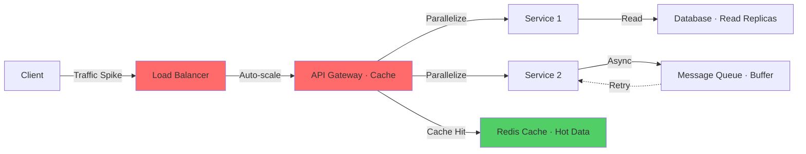

# Performance & Scalability — Microservices Interview

> **Level:** Intermediate to Advanced
> **Section:** [Microservices Interview Guide](../index.md)

---

## Identifying Performance Bottlenecks

Techniques for finding and optimizing slow systems.

??? question "Your system shows high latency only during peak hours. How will you identify the bottleneck?"
    Use distributed tracing (e.g., Jaeger, Zipkin) to identify which service/component is slow. Analyze database query performance during peaks. Check CPU, memory, and network utilization. Look for lock contention or resource saturation. Monitor JVM garbage collection pauses. Analyze thread pool saturation. Use load testing to reproduce the issue. Check for cascading failures from slow dependency.

??? question "You notice uneven load distribution across instances. What could be wrong?"
    Check the load balancer algorithm — ensure it's health-aware. Verify service instances have similar performance (no slow instances). Check if sticky sessions are misconfigured. Look for request affinity issues. Verify DNS round-robin is working. Check if some instances are under more load due to colocation. Implement least-connections or weighted round-robin balancing. Monitor instance metrics individually.

??? question "A database becomes the bottleneck for read operations. How will you optimize?"
    Implement read replicas for read-heavy workloads. Add caching layer (Redis, Memcached) for frequently accessed data. Optimize queries — add indexes, avoid N+1 queries. Implement pagination for large result sets. Use connection pooling to avoid exhaustion. Consider read-only followers in multi-region setup. Implement materialized views for complex queries. Archive old data to reduce query scope.

---

## Scaling Under Load

Strategies for handling sudden traffic spikes.

??? question "A sudden traffic spike crashes multiple services. How will you scale and stabilize the system?"
    Implement auto-scaling policies based on CPU, memory, or custom metrics. Use load shedding to gracefully degrade during spikes. Implement bulkheads to prevent cascading failures. Use rate limiting and quota management. Add more replicas horizontally. Scale database read replicas if applicable. Implement caching aggressively. Use message queues to buffer requests. Implement circuit breakers to prevent overload propagation.

??? question "Your API Gateway becomes a bottleneck under load. How will you optimize it?"
    Implement horizontal scaling with load balancing. Use async processing in the gateway. Optimize routing logic and caching. Implement rate limiting to prevent overload. Use connection pooling. Cache responses at the gateway level. Consider splitting into multiple gateways by business domain. Use CDN for static content. Offload TLS termination to a load balancer. Monitor gateway metrics carefully.

??? question "How do you implement auto-scaling for microservices?"
    Define scaling policies based on CPU (70%), memory, or custom metrics (request latency, queue depth). Set min/max replicas (e.g., 2-10). Use cloud provider tools (AWS Auto Scaling, GKE Horizontal Pod Autoscaler). Include scale-down cooldown period (5-10 min) to avoid thrashing. Monitor scaling events and adjust policies. Test scaling behavior under load. Ensure health checks are accurate. Consider predictive scaling for predictable patterns.

---

## Latency Optimization

Reducing end-to-end response times.

??? question "How do you reduce tail latency in distributed systems?"
    Implement request hedging — send request to multiple replicas, use fastest response. Use timeouts aggressively to avoid hanging requests. Optimize hot paths with caching and async processing. Batch requests where possible. Use CDNs for static assets. Implement connection pooling. Monitor percentiles (p95, p99) not just averages. Profile services to identify slow code paths. Use correlation analysis to find cascading latency.

??? question "Your microservices calls create waterfall latency. How will you parallelize requests?"
    Redesign APIs to support batch requests or single-call returns. Use async/await patterns to parallelize independent calls. Implement request aggregation at API Gateway layer. Use GraphQL or gRPC for efficient data fetching. Cache intermediate results. Consider redesigning domain boundaries to reduce cross-service calls. Use eventual consistency where strict consistency isn't needed. Profile before and after to measure improvements.

---

## Caching Strategies

Implementing effective caching at multiple layers.

??? question "How do you design an effective caching strategy?"
    Identify hot data (most frequently accessed, cheapest to recompute). Use caching layers: L1 (in-process), L2 (Redis), L3 (CDN). Implement cache invalidation: TTL-based, event-based, or manual. Monitor cache hit rates (target 80%+). Use cache warming for cold starts. Implement circuit breaker for cache failures. Design fallback path if cache misses. Monitor memory usage and eviction rates. Consider distributed caching vs local caching trade-offs.

??? question "When should you NOT use caching?"
    Avoid caching for: real-time data (stock prices), highly mutable data, small datasets (faster to recompute). Don't cache if validation is expensive. Skip cache if memory is constrained. Avoid for user-specific data with privacy concerns (harder to invalidate safely). Don't cache if consistency is critical (medical/financial data). Be cautious with cross-regional caching (replication lag). Consider simpler approaches first (optimize queries, indexes).

---

## Diagram

--8<-- "_abbreviations.md"

