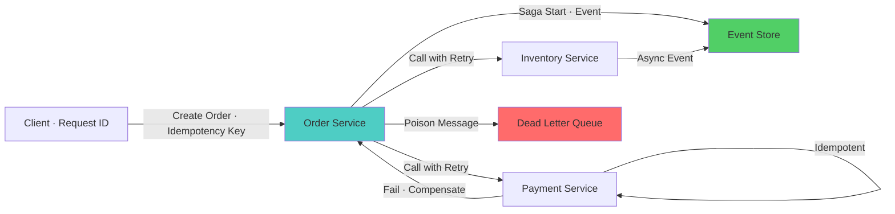

# Data Consistency & Idempotency — Microservices Interview

> **Level:** Intermediate to Advanced
> **Section:** [Microservices Interview Guide](../index.md)

---

## Distributed Transactions & Saga Pattern

Ensuring data consistency across multiple services.

??? question "Your system needs to ensure data consistency across multiple services. What approach will you use?"
    Use eventual consistency with compensating transactions (saga pattern). Implement distributed transactions carefully (2-phase commit is rarely recommended). Use event sourcing to maintain audit trail. Design for conflict resolution. Implement version vectors or timestamps. Use message queues for reliable event delivery. Consider domain-driven design to reduce cross-service consistency requirements. Implement comprehensive monitoring to detect consistency issues.

??? question "How does the Saga pattern ensure distributed transaction correctness?"
    Saga pattern orchestrates a sequence of local transactions across services. Each service performs its transaction and publishes an event. Choreography: services listen to events and trigger next step. Orchestration: coordinator service choreographs the flow. On failure, execute compensating transactions in reverse order. Design each step to be idempotent for replay safety. Use timeouts to detect stuck sagas. Monitor saga completion rates and failures. Log saga execution for debugging.

??? question "What's the difference between orchestration and choreography sagas?"
    Orchestration: central coordinator explicitly instructs each service. Easier to debug, single point of control. Choreography: services react to events from other services. More decoupled, but complex event flow. Orchestration works better for complex workflows. Choreography scales better with many services. Hybrid approach: use orchestration for critical paths, choreography for async flows. Consider maintainability and debugging difficulty when choosing.

??? question "2-phase commit (2PC) seems like it should work for distributed transactions. Why is it problematic?"
    2PC locks resources during prepare phase, blocking other transactions. Poor scalability and performance. If coordinator fails, locks held indefinitely (blocking). Doesn't work well across network partitions. Not suitable for microservices because services should be independent. Saga pattern is more appropriate for microservices (allows partial success). Use 2PC only if: single database with distributed transactions, or very tight consistency requirements with low scale.

---

## Event Deduplication & Exactly-Once Processing

Preventing duplicate event processing.

??? question "Your system processes the same event multiple times. How will you prevent duplication?"
    Implement idempotent event handlers — process the same message multiple times safely. Use event deduplication with event IDs and a store of processed IDs. Implement exactly-once processing semantics in message brokers. Use database unique constraints. Track event sequence numbers. Implement idempotency keys at the handler level. Design handlers to be side-effect free on replay. Consider event store to track processed events.

??? question "How do you implement exactly-once event processing?"
    Use messaging systems with exactly-once guarantees (Kafka with transactional reads/writes, RabbitMQ with manual acknowledgment). Implement deduplication at application level: store event ID in database before processing. Design handlers to be idempotent. Use atomic writes: write result and event ID in same transaction. Implement at-least-once delivery + idempotency = exactly-once semantics. Monitor duplicate rates. Test failure scenarios.

??? question "A message queue builds up a backlog of unprocessed events. How will you handle it?"
    Increase consumer instances to process messages in parallel. Optimize consumer processing speed — profile and optimize handler code. Implement batching to process multiple messages together. Use priority queues for critical messages. Implement rate limiting on producers if sustainable. Archive old messages if acceptable. Use dead-letter queues for poison messages. Monitor queue depth and alert on buildup. Consider stream processing frameworks for complex logic.

---

## Idempotency in Microservices

Designing operations that can be safely retried.

??? question "How do you make an API endpoint idempotent?"
    Design endpoint to produce the same result when called multiple times with same input. Use idempotency keys (unique request IDs) provided by clients. Store idempotency key with result for a time window (24 hours). On retry with same key, return cached result. Implement at application layer: deduplicate before processing. Use database unique constraints for safety. Document idempotency guarantees in API contract. Test idempotency in all failure scenarios.

??? question "A payment service must be idempotent. How will you implement it?"
    Accept idempotency key in payment request. Store idempotency key before processing payment. Check if payment already processed with same key — return cached result. Implement database transaction: update ledger and mark idempotency key as processed atomically. Handle timeout case: use polling to check if payment was processed. Design refund operation to be idempotent. Log all payment attempts. Set idempotency window (e.g., 24 hours). Monitor duplicate payment attempts.

---

## Handling Partial Failures

Gracefully degrading when some operations fail.

??? question "Your system needs to handle partial failures gracefully. How will you design it?"
    Use saga patterns (orchestration or choreography) to handle distributed transactions where some steps may fail. Implement compensating transactions to roll back partial changes. Design APIs to be partially successful — return which items succeeded/failed. Use eventual consistency where total consistency isn't critical. Log partial failures separately for replay/recovery. Notify users of partial failures. Implement retry logic for transient failures. Use timeouts to detect stuck operations.

??? question "A batch operation succeeds partially. How will you handle it?"
    Return detailed result: which items succeeded, which failed, with reasons. Use status codes (202 Accepted for async, 207 Multi-Status for batch). Provide mechanism to retry failed items without reprocessing successful ones. Implement idempotency to allow safe retries. Log partial failure for debugging. Notify user of partial success. Design compensating transaction if needed. Consider atomicity requirements: all-or-nothing vs partial success acceptable.

---

## Diagram

--8<-- "_abbreviations.md"

