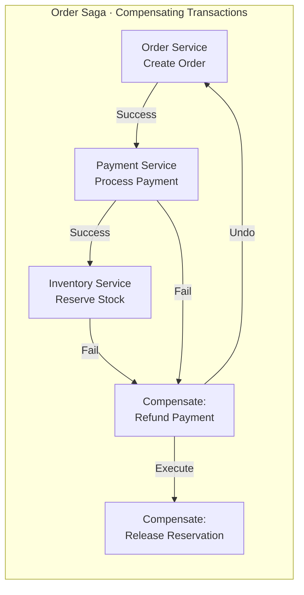
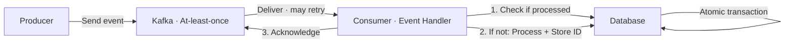
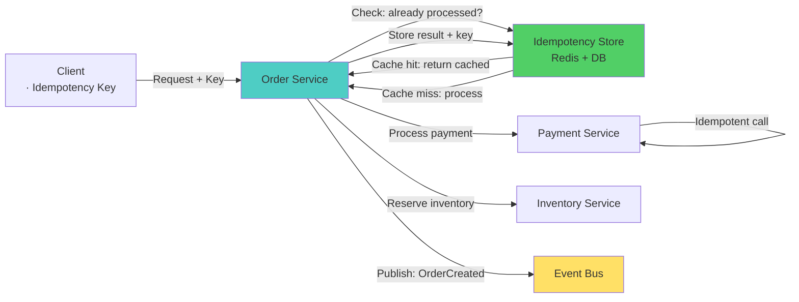

# Data Consistency & Idempotency — Microservices Interview

> **Target:** Senior Engineer · Engineering Lead · Pre-Architect
> **Focus:** Saga pattern, event sourcing, idempotency, eventual consistency, distributed transactions

---

## Q: How do you ensure data consistency across multiple services?

*Why interviewers ask this:* This is the fundamental challenge of microservices. Tests understanding of eventual consistency, saga patterns, and trade-offs vs traditional ACID.

### Answer

In a monolith with a single database, you use ACID transactions. In microservices, each service has its own database — ACID transactions across services are impossible.

**Three approaches:**

| Approach | Consistency Model | Complexity | Use Case |
|----------|------------------|-----------|----------|
| **Saga Pattern** | Eventual consistency | Medium | Distributed business transactions (orders, payments) |
| **Event Sourcing** | Eventual consistency | High | Audit trail, temporal queries, event-driven systems |
| **2-Phase Commit** | Strong consistency | High complexity, poor performance | Rare — only tightly coupled legacy systems |

**Saga Pattern — Recommended:**



Saga orchestrates a sequence of **local** (per-service) transactions. On failure, compensating transactions execute in **reverse order**:
1. Order Service creates order
2. Payment Service processes payment
3. If payment fails → trigger refund (compensating tx)
4. If refund fails → escalate to manual intervention

!!! tip "Architect Insight"
    Sagas don't guarantee atomicity like a database transaction — they guarantee **eventual consistency** and **durability** (no money lost, no order lost). Design each saga step to be **idempotent** so retries are safe.

---

## Q: Orchestration vs Choreography Sagas — Which should you use?

### Answer

**Orchestration** — Central coordinator explicitly manages the flow:
```
Client → OrderSagaOrchestrator → [calls] → PaymentService
                              ↓
                         → InventoryService
                              ↓
                         → ShippingService
```

**Choreography** — Services react to events, flow emerges from interactions:
```
Client → OrderService (publishes: OrderCreated)
           ↓
    PaymentService (listens, publishes: PaymentProcessed)
           ↓
    InventoryService (listens, publishes: InventoryReserved)
           ↓
    ShippingService (listens)
```

**Trade-off comparison:**

|                  | Orchestration                         | Choreography                   |
|:-----------------|:--------------------------------------|:-------------------------------|
| Coupling         | Medium — coordinator knows all steps  | Low — each service independent |
| Debugging        | Easy — one place to trace flow        | Hard — distributed event logic |
| Complexity       | Single orchestrator service           | Many event listeners           |
| Testing          | Mock dependencies in orchestrator     | Integration test entire flow   |
| Scalability      | Orchestrator can become bottleneck    | Scales better                  |
| Failure recovery | Timeouts + compensations in one place | Scattered across services      |

**Recommendation:**
- **Orchestration** for critical, complex business processes (order → payment → inventory → shipping)
- **Choreography** for loosely coupled events (user signup → send welcome email, create analytics record)
- **Hybrid** for best of both: orchestrate order creation, choreograph notifications

---

## Q: Why is 2-Phase Commit problematic in microservices?

*Why interviewers ask this:* Tests whether you understand why old database patterns don't scale in distributed systems.

### Answer

2PC (Two-Phase Commit) is a database algorithm for atomic updates across multiple databases:

**Phase 1 (Prepare):** Coordinator asks all participants "Can you commit?" — they lock resources and respond.
**Phase 2 (Commit):** If all yes, commit. If any no, rollback.

**Why it fails in microservices:**

| Problem                | Impact                                                                                           |
|:-----------------------|:-------------------------------------------------------------------------------------------------|
| **Resource locks**     | Prepare phase holds locks on Payment, Inventory for the entire duration — other requests blocked |
| **Blocking**           | If one service is slow, all others wait (cascading slowness)                                     |
| **Network partitions** | If coordinator crashes, participants hold locks forever (distributed deadlock)                   |
| **Scalability**        | Doesn't work across service boundaries reliably — services should be independent                 |
| **Latency**            | Synchronous, multi-round-trip protocol — slow                                                    |

**Example failure:**
```
Coordinator: "All commit?"
PaymentService: "Yes" ✓
InventoryService: [network partition, no response]
Coordinator: [waiting indefinitely]
Other orders: [blocked on payment/inventory locks]
```

**When 2PC is safe:**
- Single database with distributed transactions (no network partitions)
- Tightly coupled legacy systems where you control all components
- Very low scale (not at production microservices scale)

**Use Saga instead** — allows partial success and recovers gracefully.

---

## Q: How do you implement idempotent API endpoints?

*Why interviewers ask this:* Idempotency is critical for safe retries. Tests system thinking about failure scenarios.

### Answer

**Idempotency** means calling the same operation multiple times with the same input produces the same result as calling it once.

**Implementation strategy:**

1. **Client provides idempotency key** (UUID, unique per logical operation):
   ```json
   POST /api/payments
   {
     "idempotencyKey": "550e8400-e29b-41d4-a716-446655440000",
     "amount": 100.00,
     "orderId": "12345"
   }
   ```

2. **Server checks if key was already processed**:
   ```java
   @PostMapping("/payments")
   public ResponseEntity<PaymentResponse> pay(
       @RequestBody PaymentRequest request,
       @RequestHeader("Idempotency-Key") String key) {

       // Check if already processed
       Optional<PaymentResponse> cached = idempotencyStore.get(key);
       if (cached.isPresent()) {
           return ResponseEntity.ok(cached.get()); // Return cached result
       }

       // Process payment
       Payment payment = paymentService.process(request);

       // Store result with idempotency key
       idempotencyStore.put(key, response, ttl = 24_hours);

       return ResponseEntity.ok(response);
   }
   ```

3. **Store the result for a time window** (24 hours typical):
   ```sql
   CREATE TABLE idempotency_results (
       key VARCHAR(36) PRIMARY KEY,
       result JSONB NOT NULL,
       created_at TIMESTAMP NOT NULL,
       expires_at TIMESTAMP NOT NULL
   );
   ```

**For payment services specifically:**
```java
@Service
public class PaymentService {

    @Transactional
    public PaymentResponse processPayment(PaymentRequest req, String idempotencyKey) {
        // All in one transaction — atomic
        PaymentResponse response = callPaymentGateway(req);
        idempotencyRepo.save(new IdempotencyRecord(idempotencyKey, response));
        return response;
    }
}
```

!!! warning "Common Mistake"
    Don't check idempotency AFTER processing — if the check fails and you process twice, you've already duplicated the charge. Check BEFORE, and only proceed if not found.

---

## Q: How do you implement exactly-once event processing?

*Why interviewers ask this:* Event-driven systems at scale face duplicate message challenges. Tests understanding of messaging guarantees and application-level deduplication.

### Answer

**Message delivery guarantees:**

| Guarantee         | How it works                  | When duplicates occur                             |
|:------------------|:------------------------------|:--------------------------------------------------|
| **At-most-once**  | Sent once, may be lost        | Network failure before server acks                |
| **At-least-once** | Resent until acked            | Server crashes after processing but before acking |
| **Exactly-once**  | At-least-once + deduplication | Application responsibility                        |

Most message brokers offer **at-least-once** (safer than at-most-once). To achieve **exactly-once**:



**Implementation:**

```java
@KafkaListener(topics = "orders")
public void handleOrderEvent(OrderEvent event, Acknowledgment ack) throws Exception {
    String eventId = event.getEventId(); // UUID

    try {
        // Step 1: Check if already processed
        if (deduplicationStore.hasProcessed(eventId)) {
            log.info("Event {} already processed, skipping", eventId);
            ack.acknowledge();
            return;
        }

        // Step 2: Process event + store ID in SAME transaction
        @Transactional
        void processInTransaction() {
            // Process the event
            Order order = orderService.createOrder(event);

            // Store the event ID to prevent reprocessing
            deduplicationStore.markProcessed(eventId, Instant.now());
            // ^^ Both writes happen atomically in the DB transaction
        }

        // Step 3: Acknowledge after successful processing
        ack.acknowledge();

    } catch (Exception e) {
        log.error("Failed to process event {}, will retry", eventId, e);
        // Don't acknowledge — Kafka will redeliver
        throw e;
    }
}
```

**Deduplication store schema:**
```sql
CREATE TABLE processed_events (
    event_id VARCHAR(36) PRIMARY KEY,
    processed_at TIMESTAMP NOT NULL,
    expires_at TIMESTAMP NOT NULL
);
CREATE INDEX idx_event_id ON processed_events(event_id);
```

**Key principle:** Process event + store event ID in the **same database transaction**. If either fails, both rollback. On retry, the event ID check prevents reprocessing.

---

## Q: A message queue is backing up. How do you diagnose and fix it?

### Answer

**Diagnose:**

| Metric | Healthy | Warning | Critical |
|--------|---------|---------|----------|
| Queue depth | < 1K | 1K-10K | > 10K |
| Consumer lag | < 1 sec | 1-30 sec | > 1 min |
| Throughput | > 1K msg/sec | 100-1K | < 100 |

**Common causes and fixes:**

```
Queue backing up?
├─ Consumer slow?
│  ├─ Optimize handler code (profile, add caching)
│  ├─ Parallelize: increase consumer instances
│  └─ Batch: process multiple messages together
├─ Downstream service down?
│  ├─ Circuit break: stop consuming, prevent cascading
│  └─ Retry: exponential backoff + dead letter queue
├─ Message poison (repeatedly fails)?
│  ├─ Move to dead letter queue
│  ├─ Alert ops
│  └─ Manual review and fix
└─ Sustained high volume?
   ├─ Add more partitions (Kafka)
   ├─ Auto-scale consumers
   └─ Archive old messages
```

**Production example — Spring Cloud Stream:**
```java
@Configuration
public class ConsumerConfig {

    @Bean
    public Consumer<Message<OrderEvent>> handleOrder() {
        return message -> {
            OrderEvent event = message.getPayload();
            try {
                orderService.processOrder(event);
            } catch (TemporaryException e) {
                // Retry with backoff
                throw new AmqpRejectAndDontRequeueException("Temporary failure", e);
            } catch (PermanentException e) {
                // Send to dead letter
                deadLetterQueue.send(event);
                log.error("Unrecoverable error, moved to DLQ", e);
            }
        };
    }
}
```

---

## Diagram — Complete Idempotent Order Processing



--8<-- "_abbreviations.md"
