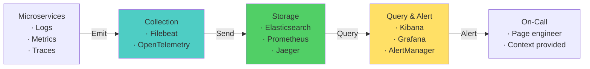

# Observability & Debugging — Microservices Interview

> **Target:** Senior Engineer · Engineering Lead · Pre-Architect
> **Focus:** Centralized logging, distributed tracing, metrics, SLOs

---

## Q: How do you implement centralized logging across dozens of microservices?

*Why interviewers ask this:* Distributed logging is foundational to debugging. Tests understanding of log aggregation, correlation, and searchability at scale.

### Answer

**Logging stack:**

```
Services (stdout)
  ↓ (JSON structured logs)
Filebeat/Logstash (collect & parse)
  ↓
Elasticsearch (index & store)
  ↓
Kibana (search & visualize)
```

**Spring Boot structured logging:**

```java
@Slf4j
@RestController
public class OrderController {

    @PostMapping("/orders")
    public Order createOrder(@RequestBody OrderRequest req) {
        String traceId = MDC.get("traceId");
        String spanId = MDC.get("spanId");
        
        log.info("order.created", 
            kv("traceId", traceId),
            kv("spanId", spanId),
            kv("customerId", req.getCustomerId()),
            kv("amount", req.getAmount())
        );
        
        return orderService.create(req);
    }
}
```

**Logback config with JSON:**

```xml
<appender name="STDOUT" class="ch.qos.logback.core.ConsoleAppender">
  <encoder class="net.logstash.logback.encoder.LogstashEncoder">
    <fieldNames>
      <timestamp>@timestamp</timestamp>
      <version>@version</version>
      <message>message</message>
      <loggerName>logger_name</loggerName>
    </fieldNames>
  </encoder>
</appender>
```

**Elasticsearch query:**

```
GET /logs-*/_search
{
  "query": {
    "bool": {
      "must": [
        {"match": {"traceId": "123abc"}},
        {"match": {"level": "ERROR"}}
      ]
    }
  }
}
```

!!! tip "Architect Insight"
    Include correlation IDs (trace ID) in every log. This is the single most important thing for distributed debugging.

---

## Q: How do you implement distributed tracing across service boundaries?

### Answer

**Trace propagation:**

```
Client Request
  ↓ Generate traceId="abc123", spanId="span1"
  ↓ Pass in header: X-Trace-ID: abc123, X-Span-ID: span1
Service A
  ↓ Extract headers, create child span
  ↓ Call Service B with parent spanId
Service B
  ↓ Extract headers, add to new span
  ↓ Response includes spanId
Service A
  ↓ Collect all spans, send to collector (Jaeger)
Jaeger
  ↓ Visualize trace flow and latency breakdown
```

**Spring Cloud Sleuth + Jaeger:**

```java
// Pom.xml
<dependency>
    <groupId>org.springframework.cloud</groupId>
    <artifactId>spring-cloud-starter-sleuth</artifactId>
</dependency>
<dependency>
    <groupId>org.springframework.cloud</groupId>
    <artifactId>spring-cloud-sleuth-otel-exporter-jaeger</artifactId>
</dependency>
```

**Headers automatically added:**

```
GET /orders/123 HTTP/1.1
X-B3-TraceId: abc123
X-B3-SpanId: span456
X-B3-ParentSpanId: span1
```

**Sampling strategy:**

```yaml
spring:
  sleuth:
    sampler:
      probability: 0.1  # Sample 10% of traces (1% in prod)
      rate: 100  # Or sample 100 traces/sec
```

!!! warning "Common Mistake"
    Sample everything in dev (probability: 1.0), but only 1-10% in production or you'll overwhelm Jaeger with data.

---

## Q: What metrics should you monitor for microservices health?

### Answer

**Golden Signals** (essential):

| Signal | Target | Alert If |
|--------|--------|----------|
| **Latency** | p50 < 200ms, p99 < 1s | p99 > 2s for 5+ min |
| **Errors** | < 0.1% error rate | Error rate > 1% |
| **Saturation** | CPU < 70% | CPU > 85% or memory > 90% |
| **Traffic** | Monitor ramp | Unexpected drop (outage) or spike |

**Spring Boot + Prometheus:**

```java
@Bean
public MeterBinder orderMetrics(OrderRepository repo) {
    return (registry) -> {
        Gauge.builder("orders.total", repo, OrderRepository::count)
            .description("Total orders in system")
            .register(registry);
        
        Timer.builder("order.create.time")
            .description("Time to create order")
            .publishPercentiles(0.5, 0.95, 0.99)
            .register(registry);
    };
}
```

**Prometheus scrape config:**

```yaml
global:
  scrape_interval: 15s

scrape_configs:
  - job_name: 'order-service'
    static_configs:
      - targets: ['localhost:8080']
    metrics_path: '/actuator/prometheus'
```

**Alerting rules:**

```yaml
groups:
  - name: microservices
    rules:
      - alert: HighErrorRate
        expr: rate(http_requests_total{status=~"5.."}[5m]) > 0.01
        for: 5m
        annotations:
          summary: "Error rate > 1% for {{ $labels.service }}"
          
      - alert: PodRestartingTooOften
        expr: rate(container_last_seen[5m]) > 0.1
        annotations:
          summary: "Pod {{ $labels.pod }} restarting frequently"
```

---

## Q: How do you implement effective alerting without alert fatigue?

### Answer

**Alert design principles:**

```
Good alerts:
- Based on SLO (Service Level Objective)
- Actionable (on-call knows what to do)
- Signal-to-noise > 90% (low false positives)

Bad alerts:
- CPU > 50% (constantly triggers)
- Page 20 alerts per hour (meaningless)
- "Something is wrong" with no context
```

**SLO-based alerting:**

```
SLO: 99.9% availability = 99.9% requests succeed
     = 0.001 error budget per day
     
Alert if:
- Error rate > 1% for 5+ minutes (burns budget too fast)
- Error rate > 0.5% for 1+ minute (indicates trend)

Don't alert on:
- Error rate = 0% for 1 second (noise)
- CPU = 60% (arbitrary threshold)
```

**Severity levels:**

```
CRITICAL (page on-call):
  - Service completely down
  - Error rate > 5%
  - Database unavailable

WARNING (create ticket):
  - Error rate 1-5%
  - Latency p99 > 5s
  - Disk usage > 80%

INFO (log only):
  - Warnings
  - Deprecation notices
```

---

## Diagram — Observability Stack



--8<-- "_abbreviations.md"
