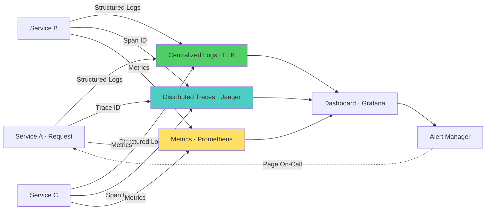

# Observability & Debugging — Microservices Interview

> **Level:** Intermediate to Advanced
> **Section:** [Microservices Interview Guide](../index.md)

---

## Distributed Logging

Centralizing and analyzing logs across services.

??? question "Your logs are distributed across services making debugging difficult. How will you centralize logging?"
    Implement centralized logging (ELK Stack, Splunk, DataDog, etc.). Add structured logging with correlation IDs across all services. Include request IDs in logs automatically via middleware. Log at appropriate levels (INFO, WARN, ERROR). Add context information (service name, instance ID, user ID). Implement log aggregation pipelines. Use log sampling for high-volume services. Create dashboards for log analysis. Implement alerting on error patterns.

??? question "A service silently fails without proper logs. How will you improve observability?"
    Ensure all code paths log errors with full context. Implement exception handlers that capture stack traces. Use observability tools (metrics, traces, logs). Implement health checks and expose metrics. Add debug logging in development. Use APM tools (Application Performance Monitoring) to detect silent failures. Implement alerting on error rates and latency anomalies. Add circuit breaker monitoring. Implement canary deployments with validation.

??? question "How do you structure logs for efficient searching and debugging?"
    Use structured logging (JSON format) instead of unstructured text. Include correlation IDs to trace requests across services. Add contextual fields: service name, instance, environment, user ID. Use consistent log levels: DEBUG, INFO, WARN, ERROR, FATAL. Add timestamps in UTC. Include full stack traces for errors. Use field names consistently across all services. Implement log parsing and indexing in log aggregation tool. Create saved searches for common debugging scenarios.

---

## Distributed Tracing

Understanding request flow across services.

??? question "You need to trace a request across multiple services. How will you implement distributed tracing?"
    Use a distributed tracing system (Jaeger, Zipkin, or vendor-managed like DataDog). Implement trace propagation by passing trace IDs and span IDs across service boundaries. Use Spring Cloud Sleuth for automatic instrumentation. Instrument HTTP calls, database queries, and message handling. Sample traces intelligently to avoid overhead. Create dashboards showing request flow. Analyze traces to identify slow operations. Monitor critical path latency.

??? question "How do you implement trace context propagation?"
    Include trace ID and span ID in request headers (X-Trace-ID, X-Span-ID). Pass headers across HTTP calls, message queues, and async operations. Use tracing library to automatically extract/inject context. For async operations, propagate context when creating tasks. For message queues, include trace context in message headers. Ensure all downstream calls include parent span ID. Monitor context propagation failure. Test propagation in integration tests.

??? question "Distributed tracing adds overhead to production. How do you minimize it?"
    Implement smart sampling: sample high-error-rate requests at 100%, others at 1-5%. Use tail sampling to capture slow requests. Implement dynamic sampling based on load. Compress trace data before transmission. Batch trace exports to reduce network calls. Use asynchronous trace export. Monitor tracing overhead (should be <1% CPU/memory). Implement trace retention policies (keep 7-30 days). Use sampling at span level for verbose services. Test performance impact in staging.

---

## Metrics & Monitoring

Tracking system health and performance.

??? question "What metrics should you monitor for microservices?"
    Monitor Golden Signals: latency (p50, p95, p99), traffic (requests/sec), errors (rate, types), saturation (CPU, memory, queue depth). Add business metrics: orders processed, revenue, user conversions. Monitor per-service: response time, error rate, queue depth. Monitor infrastructure: CPU, memory, disk, network. Monitor dependencies: database latency, external API calls. Set meaningful thresholds and alerts. Create dashboards for different audiences (ops, dev, business). Review metrics regularly for anomalies.

??? question "How do you implement effective alerting without alert fatigue?"
    Set thresholds based on SLOs (Service Level Objectives), not arbitrary values. Implement multi-condition alerts: latency AND error rate together. Use dynamic thresholds (baseline + deviation). Group related alerts to avoid duplicates. Implement severity levels (critical, warning, info). Set escalation policies. Include remediation steps in alerts. Test alerts regularly. Tune thresholds monthly based on false positive rate. Target <5% false positive rate. Implement on-call rotations for critical alerts.

??? question "A production incident goes undetected for hours. How will you improve monitoring?"
    Implement SLOs (Service Level Objectives) with alerting. Monitor error rates, latency, and availability explicitly. Add synthetic monitoring — proactive checks from outside. Implement health checks and expose metrics. Set up low-latency alerting (<1 minute detection). Include business metrics not just technical. Implement anomaly detection for unusual patterns. Create clear runbooks for common alerts. Test incident response regularly. Use observability tools that correlate signals (logs, traces, metrics).

---

## Application Performance Monitoring (APM)

Using APM tools to diagnose performance issues.

??? question "Should you invest in an APM tool? What value does it provide?"
    APM tools (DataDog, New Relic, Dynatrace) automatically instrument code without code changes. Provide distributed tracing, service maps, and root cause analysis. Identify bottlenecks across services automatically. Track database queries and slow endpoints. Monitor dependencies and external calls. Reduce troubleshooting time significantly. Start with open source (Jaeger, Prometheus) for small systems. Invest in commercial APM for large deployments (100+ services, high traffic). ROI: faster incident resolution, better capacity planning.

---

## Diagram

--8<-- "_abbreviations.md"

