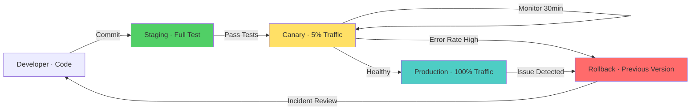

# Deployment & Compatibility — Microservices Interview

> **Level:** Intermediate to Advanced
> **Section:** [Microservices Interview Guide](../index.md)

---

## API Versioning & Backward Compatibility

Managing API evolution without breaking clients.

??? question "A deployment introduces version mismatch between services. How will you maintain compatibility?"
    Use semantic versioning for APIs. Implement API versioning (URL path, headers, or request body). Design APIs to be forward-compatible — ignore unknown fields. Implement deprecation cycles and communicate timelines. Use feature flags for gradual rollouts. Validate request/response schemas at runtime. Use contracts (Pact, Spring Cloud Contract) to test compatibility. Implement canary deployments. Support multiple API versions simultaneously.

??? question "How do you handle breaking API changes safely?"
    Announce deprecation timeline (e.g., 6 months notice). Support old and new API versions simultaneously. Implement feature flags for gradual migration. Use versioning in URL or header (v1 vs v2). Provide migration guide for clients. Implement client version detection and warnings. Test compatibility thoroughly before deprecation. Monitor old API usage to know when it's safe to remove. Use gradual rollout (canary) to catch issues early. Provide clear error messages for deprecated endpoints.

??? question "How do you test API compatibility between services?"
    Use contract testing frameworks (Pact, Spring Cloud Contract). Define contracts for expected request/response format. Verify producer adheres to contract. Verify consumer respects contract. Run integration tests with multiple API versions. Test both old and new clients with new API version. Use API gateway to validate schema. Implement request/response validation at service boundary. Use OpenAPI/Swagger for API documentation and validation. Test in staging before production rollout.

---

## Deployment Strategies

Safely rolling out changes with minimal risk.

??? question "A deployment introduces version mismatch between services. How will you ensure safe rollout?"
    Use semantic versioning for APIs. Implement canary deployments (5-10% traffic). Use blue-green deployments for quick rollback. Implement feature flags for gradual feature exposure. Monitor error rates, latency, and business metrics during rollout. Set automatic rollback thresholds. Have runbooks for common issues. Validate in staging environment first. Use smoke tests to verify critical paths. Coordinate deployment with team and stakeholders.

??? question "How do you implement canary deployments?"
    Deploy new version to small percentage of traffic (5-10%). Route based on user segment, region, or percentage. Monitor error rate, latency, and business metrics closely. If healthy, gradually increase traffic (10% -> 25% -> 50% -> 100%). If issues detected, rollback to previous version. Use time-based canary (monitor for 30 minutes). Set clear success metrics and thresholds. Automate canary progression. Use service mesh (Istio) for easy traffic splitting. Practice canary deployments in staging.

??? question "Blue-green deployment vs. canary deployment — when to use each?"
    Blue-green: deploy to separate environment, quick switch traffic. Fast rollback, but higher resource usage. Good for: database migrations, coordinated multi-service deployments. Canary: gradual traffic shift, small blast radius. Lower resource overhead, but slower rollout. Good for: microservices, testing in production, gradual validation. Hybrid: use canary for validation, quick blue-green for final switch. Consider blast radius, rollback time, and resource constraints.

---

## Feature Flags & Gradual Rollouts

Decoupling deployment from feature release.

??? question "A feature is ready but you want to release gradually. How will you use feature flags?"
    Implement feature flags in code (conditional logic). Externalize flag configuration (feature flag service). Control visibility by user segment, percentage, or region. Start with small user segment (1%). Monitor metrics for regressions. Gradually increase exposure (10% -> 25% -> 50% -> 100%). Use local development overrides for testing. Clean up flags after full rollout. Monitor flag performance impact. Document flag usage and expiration. Use feature flag service (LaunchDarkly, Unleash) for production.

??? question "How do you avoid technical debt from feature flags?"
    Set expiration dates on flags — remove after release or holdout period. Audit unused flags regularly. Include cleanup in definition of done. Use static analysis to find dead flag code. Document flag ownership and removal date. Clean up flags in code review process. Set reminder for flag owners. Design flags as feature vs. ops (cleanup ops flags immediately). Version flag configuration. Monitor flag coverage and complexity. Use consistent naming conventions.

---

## Handling Database Schema Changes

Evolving database schema without downtime.

??? question "You need to deploy code and database schema changes together. How will you avoid downtime?"
    Deploy in phases: 1) add new schema (backward compatible), 2) deploy code using both old and new schema, 3) migrate data, 4) remove old schema. Make schema changes backward compatible (add column with default). Use dual writes during migration. Implement rollback strategy for failed migrations. Test migration in staging with production data volume. Use backward-compatible code changes. Coordinate database and application deployments. Consider online schema migration tools (Percona, gh-ost). Run migrations during low-traffic windows if possible.

??? question "Adding a NOT NULL column without default to a large table risks downtime. How do you handle it?"
    Add column as nullable first. Deploy code to populate the column (migration job). Make column NOT NULL after data migration complete. Alternatively: add column with default value (PostgreSQL supports this). Use online schema migration tools. Pre-allocate space for new column. Run migration during maintenance window on large tables. Split migration into smaller batches. Monitor table locks and query performance. Have rollback plan ready. Test with production-sized data in staging.

---

## Versioning & Rollback Strategy

Planning for failure and quick recovery.

??? question "A service deployment fails in production. How will you rollback quickly?"
    Maintain previous version container/artifact. Use orchestration platform (Kubernetes) to revert deployment. Monitor deployment health automatically. Set automatic rollback threshold (error rate > 5%). Have manual rollback procedure documented. Test rollback regularly. Keep deployment history. Coordinate with dependent services on rollback. Communicate rollback to stakeholders. Have incident runbook. Consider database state — is rollback safe? Use feature flags as alternative to full rollback.

---

## Diagram

--8<-- "_abbreviations.md"

