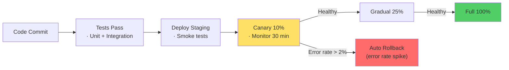

# Deployment & Compatibility — Microservices Interview

> **Target:** Senior Engineer · Engineering Lead · Pre-Architect
> **Focus:** API versioning, deployment strategies, feature flags, schema evolution

---

## Q: How do you deploy code changes without breaking clients?

*Why interviewers ask this:* Safe deployments are the difference between seamless rolling updates and widespread outages.

### Answer

**Deployment safety layers:**

```
API Versioning → Feature Flags → Canary Deployment → Rollback Plan
```

**Safe API versioning:**

```
Rules:
1. Add fields, never remove
2. Old clients ignore unknown fields
3. Support old + new versions simultaneously

Example:
OrderV1 = {id, amount}
OrderV2 = {id, amount, estimatedDelivery}

Both /v1/orders and /v2/orders live for 6 months, then /v1 retired
```

**Feature flag pattern:**

```java
@Configuration
public class FeatureFlagsConfig {

    @Bean
    public FeatureFlagService featureFlags() {
        return new FeatureFlagService();
    }
}

@Service
public class OrderService {

    @Autowired
    private FeatureFlagService flags;

    public OrderResponse createOrder(OrderRequest req) {
        if (flags.isEnabled("new-checkout-flow")) {
            return newCheckoutFlow(req);
        }
        return legacyCheckoutFlow(req);
    }
}
```

**Canary deployment:**

```yaml
# Deploy new version to 10% of traffic
apiVersion: networking.istio.io/v1beta1
kind: VirtualService
metadata:
  name: order-service
spec:
  hosts:
    - order-service
  http:
    - match:
        - headers:
            user-id:
              regex: ".*-canary$"  # 10% of users
      route:
        - destination:
            host: order-service
            subset: v2
    - route:
        - destination:
            host: order-service
            subset: v1  # 90% traffic stays on v1
```

**Monitoring canary health:**

```
If error rate (v2) > error rate (v1) × 2 → rollback immediately
If latency (v2) > latency (v1) + 500ms → rollback
Otherwise → promote to 100% after 30 minutes
```

!!! tip "Architect Insight"
    Canary deployment separates "code deployment" (safe, instant) from "feature release" (gradual, monitored). This is the most important safety mechanism.

---

## Q: How do you handle breaking schema changes?

### Answer

**Database migration pattern (zero-downtime):**

```
BEFORE: orders = {id, customer_id, amount}

Step 1: Add new column (nullable)
ALTER TABLE orders ADD COLUMN status VARCHAR(20) DEFAULT 'pending';

Step 2: Deploy code that reads/writes status (old code ignores it)
OrderService:
  - Write: both old and new columns
  - Read: check new column first, fall back to old

Step 3: Data migration (while service is running)
UPDATE orders SET status = 'completed' WHERE completed = true;

Step 4: Remove old column (can be deferred months)
ALTER TABLE orders DROP COLUMN completed;
```

**Version your events too:**

```java
// Original event
public class OrderCreatedEvent {
    public String orderId;
    public BigDecimal amount;
}

// After adding field, version it
public class OrderCreatedEventV2 {
    public String orderId;
    public BigDecimal amount;
    public String currency;  // New field
}

// Consumer handles both
public void handleOrderEvent(OrderCreatedEvent event) {
    if (event instanceof OrderCreatedEventV2) {
        currency = ((OrderCreatedEventV2) event).currency;
    } else {
        currency = "USD";  // Default for old events
    }
}
```

---

## Q: How do you manage feature flags at scale?

### Answer

**Feature flag service:**

```java
@Service
public class FeatureFlagService {

    @Autowired
    private FeatureFlagRepository repo;
    
    @Autowired
    private RedisTemplate<String, Boolean> cache;

    public boolean isEnabled(String flag, String userId) {
        // Fast path: check cache
        Boolean cached = cache.opsForValue().get("flag:" + flag + ":" + userId);
        if (cached != null) return cached;
        
        // Miss: check database
        FeatureFlag ff = repo.findById(flag).orElse(null);
        if (ff == null) return false;
        
        // Evaluate: is this user in the cohort?
        boolean enabled = ff.isEnabledForUser(userId);
        cache.opsForValue().set("flag:" + flag + ":" + userId, enabled, Duration.ofMinutes(5));
        return enabled;
    }
}
```

**Flag types:**

| Type | Rollout | Example |
|------|---------|---------|
| **Percentage** | Enable for X% of users | "new-checkout": 10% today → 50% tomorrow |
| **User ID** | Enable for specific user set | "vip-users": enable for VIP customer segment |
| **Environment** | Enable per environment | "debug-logging": enabled in staging only |
| **Time-based** | Enable at specific time | "black-friday-sale": enable Nov 28-30 |

**Cleanup:**

```java
// After 3 weeks in production, feature is stable
@Scheduled(cron = "0 0 0 * * ?")
public void cleanupOldFlags() {
    flagRepository.deleteByCreatedBefore(LocalDate.now().minusMonths(1));
}
```

---

## Diagram — Safe Deployment Pipeline



--8<-- "_abbreviations.md"
