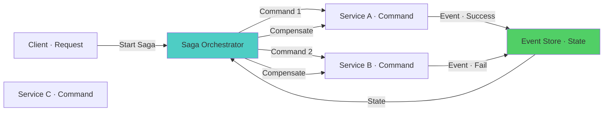

# Advanced Patterns — Microservices Interview

> **Level:** Advanced
> **Section:** [Microservices Interview Guide](../index.md)

---

## CQRS & Event Sourcing

Advanced patterns for complex domains.

??? question "What is CQRS (Command Query Responsibility Segregation)?"
    CQRS separates read and write operations into different models. Commands modify state (create order). Queries read from optimized read model (list orders). Decouple command processing from query response. Use event sourcing with CQRS: commands generate events, events update both command and read stores. Benefits: independent scaling of reads/writes, optimized data models for each. Complexity: eventual consistency between read/write models, debugging harder. Use CQRS for: complex domains, high read/write mismatch, complex queries.

??? question "What is Event Sourcing?"
    Event sourcing stores all state changes as immutable events. Application state reconstructed by replaying events. Benefits: audit trail, temporal queries, debugging. Challenges: event schema evolution, eventual consistency. Use with event store (EventStoreDB, Kafka). Implement snapshotting for performance. Design events to be domain-agnostic. Version events for schema evolution. Use CQRS to handle query complexity. Test event replay scenarios. Consider storage and processing complexity.

??? question "How do you handle schema evolution in Event Sourcing?"
    Design events to be self-describing with version field. Implement event upcasters to transform old events. Deploy upcasters before publishing new events. Never remove old event handlers. Implement versioning strategy (e.g., UserCreatedV1, UserCreatedV2). Use event transformations at read side (projections). Document event evolution. Test event migration thoroughly. Consider using JSON schema for event validation. Use semantic versioning for events.

---

## Asynchronous APIs & Streaming

Handling async operations and data streams.

??? question "Your API responses become inconsistent due to async processing. How will you handle it?"
    Design APIs to return task IDs for async operations and provide status endpoints. Implement eventual consistency patterns explicitly. Use event sourcing to maintain consistent state. Implement polling or webhooks for result notification. Cache responses with appropriate TTLs. Design APIs to clarify what is synchronous vs async. Implement idempotent result retrieval. Use state machines to track async operation state. Provide way to query operation result. Document async behavior clearly.

??? question "How do you implement webhooks for async notifications?"
    Design webhook payload with operation result and metadata. Implement retry logic for webhook delivery (exponential backoff). Support webhook signature verification (HMAC). Allow clients to register webhook endpoints. Implement webhook management API (list, update, delete). Store webhook delivery logs for debugging. Implement circuit breaker for failing webhook endpoints. Support webhook filtering (events to subscribe to). Monitor webhook delivery success rates. Consider using event streaming instead of webhooks for scale.

??? question "Should you implement request/response vs. publish/subscribe?"
    Request/response: synchronous, immediate feedback, tightly coupled. Publish/subscribe: asynchronous, decoupled, eventual consistency. Use request/response for: critical, low-latency needs (payments). Use publish/subscribe for: high-volume events, decoupling, fault tolerance. Hybrid: use request/response for user-facing, async for backend. Consider latency, throughput, and coupling requirements. Implement both for resilience. Use service mesh for request/response resilience. Use message queues for publish/subscribe.

---

## Microservices Resilience Patterns

Advanced resilience techniques.

??? question "How do you implement the bulkhead pattern?"
    Isolate resources (thread pools, connections) per service to prevent resource exhaustion from cascading failures. Each service has dedicated thread pool (e.g., 10 threads). Limits: if one service is slow, only its thread pool is exhausted. Prevents cascading failures: other services unaffected. Implement with Java: ExecutorService per service, Hystrix/Resilience4j libraries. Monitor thread pool utilization. Design bulkheads for high-risk operations. Trade-off: unused threads if service is idle.

??? question "When should you implement timeout vs. deadline propagation?"
    Timeout: maximum time to wait for response (local to service). Deadline: absolute time when result is no longer useful (propagated across services). Use deadline propagation in microservices: propagate deadline through chain. Use timeout as safety net: deadline + buffer. Configure timeout < deadline. For cascading calls: each hop reduces remaining deadline. Monitor timeouts vs. deadlines. Test timeout behavior. Implement graceful degradation when approaching deadline. Use both for comprehensive timeout handling.

??? question "How do you implement graceful degradation?"
    Detect when system is approaching capacity. Reduce functionality: return partial results, disable non-critical features. Shed load: reject low-priority requests. Degrade quality: lower resolution, less data. Use feature flags to disable features. Implement priority tiers for requests. Design APIs to support degradation. Test degradation paths. Monitor degradation events. Communicate degradation to users. Implement recovery: gradually restore functionality as load decreases.

---

## Domain-Driven Design for Microservices

Organizing services around business domains.

??? question "How does Domain-Driven Design (DDD) help with microservices?"
    DDD provides tools to partition large system into bounded contexts. Bounded context = microservice boundary. Ubiquitous language = shared terminology within context. Reduces coupling between services. Aligns microservices with business organization. Better design of service contracts. Reduces cross-service calls. Easier to scale and evolve services independently. Complexity: requires deep understanding of domain. Requires collaboration with domain experts.

??? question "What are anti-corruption layers and when do you use them?"
    Anti-corruption layer (ACL) isolates your service from legacy systems or external APIs. Translates external models to internal domain models. Prevents external changes from cascading. Centralizes integration logic. Useful for: legacy system integration, third-party API dependencies, different bounded contexts. Implement as wrapper service or adapter. Use ACL to maintain clean domain model. Can become bottleneck if overused. Document translation rules clearly.

---

## Saga Orchestration Patterns

Advanced saga patterns for complex workflows.

??? question "When should you use choreography vs. orchestration sagas?"
    Choreography: services react to events, decoupled. Good for: simple workflows, eventual consistency acceptable. Problems: difficult to understand flow, testing harder, implicit dependencies. Orchestration: central coordinator, explicit flow. Good for: complex workflows, need control, debugging. Problems: coordinator becomes bottleneck, single point of failure. Hybrid: orchestration for critical paths, choreography for notifications. Start with choreography for simplicity, evolve to orchestration if needed.

??? question "How do you handle long-running sagas?"
    Implement saga state machine: track current step, retries, compensations. Store saga state in database. Implement timeouts for stuck sagas (detect, retry, or escalate). Design compensating transactions for rollback. Use correlation IDs for tracking. Implement monitoring and alerting. Consider breaking into smaller sagas if too long. Use async messaging between steps. Test failure scenarios thoroughly. Monitor saga completion rates and failures. Document saga flow visually.

---

## Diagram

--8<-- "_abbreviations.md"

