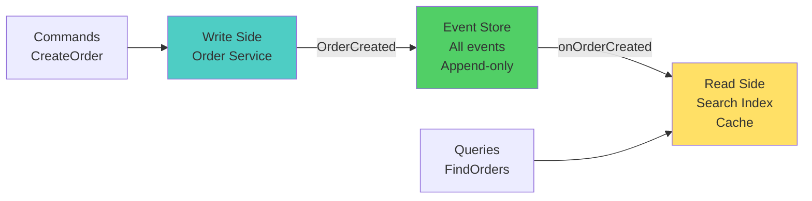

# Advanced Patterns — Microservices Interview

> **Target:** Senior Engineer · Engineering Lead · Pre-Architect
> **Focus:** CQRS, Event Sourcing, async APIs, saga patterns, DDD

---

## Q: What is CQRS (Command Query Responsibility Segregation)?

*Why interviewers ask this:* CQRS is powerful but adds complexity. Tests understanding of trade-offs and when to apply it.

### Answer

**CQRS separates read and write models:**

```
Traditional:
User → API → Database (all ops)
          ↑ (read after write)

CQRS:
Commands (write):
User → CreateOrder → Order Database (normalized, transactional)

Queries (read):
User → SearchOrders → Search Index (denormalized, optimized)
                    → Cache (Redis)
                    → Analytics DB
```

**Benefits:**

- Independent scaling (10x read traffic → scale read model only)
- Optimized data shapes per use case
- Event sourcing + audit trail

**Trade-offs:**

- More complex (two data stores to sync)
- Eventual consistency (queries lag writes by milliseconds)
- Harder debugging

**Example — Order management:**

```java
// WRITE SIDE (commands)
@Service
public class CreateOrderCommandHandler {
    public void handle(CreateOrderCommand cmd) {
        Order order = new Order(cmd.orderId, cmd.customerId, cmd.amount);
        orderRepository.save(order);
        
        // Publish event for consistency
        eventBus.publish(new OrderCreatedEvent(cmd.orderId, cmd.customerId));
    }
}

// READ SIDE (queries)
@Service
public class OrderQueryService {
    @Autowired
    private OrderSearchIndex searchIndex;  // Elasticsearch
    
    public List<Order> findOrdersByCustomer(String customerId) {
        return searchIndex.query("customer_id:" + customerId);
    }
}

// Sync the two sides
@KafkaListener(topics = "order-events")
public void onOrderCreated(OrderCreatedEvent event) {
    // Update read model when write model changes
    searchIndex.index(new OrderSearchDocument(event.orderId, event.customerId));
}
```

!!! warning "Common Mistake"
    Don't use CQRS for simple CRUD apps. Start with traditional models, add CQRS only when you have truly different read/write patterns.

---

## Q: What is Event Sourcing?

### Answer

**Event Sourcing stores all state changes as immutable events:**

```
Traditional DB:
orders = {id: 1, status: "SHIPPED", amount: 100}

Event Sourcing:
events = [
  {id: 1, type: "OrderCreated", amount: 100, timestamp: t1},
  {id: 1, type: "PaymentProcessed", amount: 100, timestamp: t2},
  {id: 1, type: "ShippingDispatched", timestamp: t3}
]

Order state = replay all events in order
```

**Benefits:**

- Complete audit trail (who did what when)
- Temporal queries (what was the state at time T?)
- Replay for debugging
- Natural fit for event-driven systems

**Implementation:**

```java
@Service
public class OrderEventStore {
    
    @Autowired
    private EventRepository eventRepo;
    
    public void apply(OrderEvent event) {
        // Immutable append-only log
        eventRepo.append(event);
    }
    
    public Order getOrderState(String orderId) {
        // Reconstruct state by replaying events
        List<OrderEvent> events = eventRepo.getEventsForAggregate(orderId);
        Order order = new Order();
        
        for (OrderEvent event : events) {
            order.apply(event);  // Mutate order by applying each event
        }
        
        return order;
    }
}
```

**Event types:**

```java
public abstract class OrderEvent {
    public String orderId;
    public LocalDateTime timestamp;
}

public class OrderCreated extends OrderEvent {
    public String customerId;
    public BigDecimal amount;
}

public class PaymentProcessed extends OrderEvent {
    public String paymentId;
}

public class OrderShipped extends OrderEvent {
    public String trackingNumber;
}
```

---

## Q: How do you implement async APIs with webhooks?

### Answer

**Webhook pattern for long-running operations:**

```
Client request:
POST /api/reports/generate
{
  "format": "pdf",
  "webhook": "https://client.com/webhook"
}

Response (async):
202 Accepted
{
  "requestId": "req-123",
  "status": "processing"
}

(Server processes asynchronously...)

Server callback (webhook):
POST https://client.com/webhook
{
  "requestId": "req-123",
  "status": "completed",
  "result": "s3://bucket/report.pdf"
}
```

**Implementation:**

```java
@PostMapping("/reports/generate")
public ResponseEntity<AsyncResponse> generateReport(
        @RequestBody ReportRequest req) {
    String requestId = UUID.randomUUID().toString();
    
    // Queue async work
    reportQueue.send(new GenerateReportJob(requestId, req));
    
    // Return immediately
    return ResponseEntity.accepted().body(
        new AsyncResponse(requestId, "processing")
    );
}

@KafkaListener(topics = "report-jobs")
public void processReport(GenerateReportJob job) {
    try {
        Report report = generatePDF(job.request);
        String s3Url = uploadToS3(report);
        
        // Call client's webhook
        httpClient.post(job.webhookUrl, new WebhookPayload(
            job.requestId, "completed", s3Url
        ));
    } catch (Exception e) {
        // Retry webhook if it fails
        retryQueue.send(new WebhookRetry(job.webhookUrl, ...));
    }
}
```

**Webhook reliability:**

- Implement retry logic (exponential backoff)
- Sign webhooks (HMAC for verification)
- Include idempotency keys (client deduplicates)
- Timeout after max retries

---

## Q: How do you decompose a monolith using Domain-Driven Design?

### Answer

**DDD gives you the map:**

```
1. Event storming (with domain experts)
   → Identify all domain events
   
2. Find bounded contexts (natural domain boundaries)
   → Order context, Payment context, Shipping context
   
3. Define each microservice
   → One service per bounded context
   
4. Identify anti-corruption layers
   → Legacy system → [ACL] → Modern service
```

**E-commerce example:**

| Bounded Context | Service | Entities |
|-----------------|---------|----------|
| Order | order-service | Order, LineItem, OrderStatus |
| Payment | payment-service | Payment, Transaction, Refund |
| Inventory | inventory-service | Product, Stock, Reservation |
| Shipping | shipping-service | Shipment, Carrier, TrackingEvent |
| Catalog | catalog-service | Product, Category, Price |

**Communication between contexts:**

```
OrderContext uses OrderPlaced event
  ↓
PaymentContext listens & processes
  ↓
PaymentProcessed event
  ↓
InventoryContext reserves stock
```

---

## Diagram — Event-Driven CQRS + Event Sourcing



--8<-- "_abbreviations.md"

