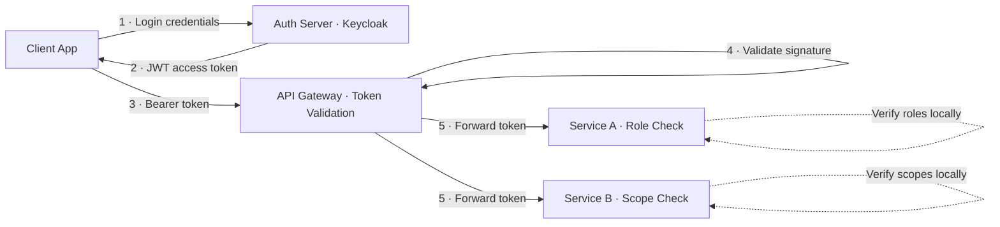
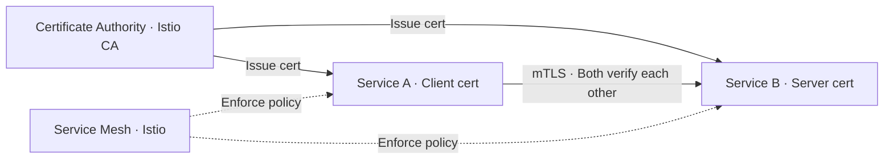
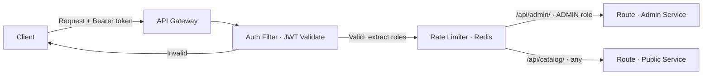
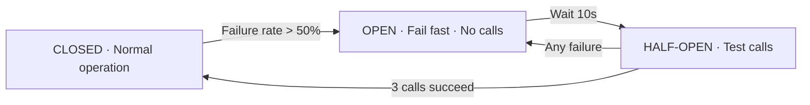

# Security — Architect-Level Interview Guide

> **Target:** Senior Engineer · Engineering Lead · Pre-Architect
> **Focus:** Authentication, Authorization, Inter-Service Security, Data Protection

---

## Q: How do you implement authentication and authorization in microservices using OAuth2 and JWT?

*Why interviewers ask this:* Tests understanding of distributed identity, token propagation, and the difference between AuthN and AuthZ across service boundaries.

### Answer

In a microservices architecture, **authentication is centralized** (identity provider / Auth server) while **authorization is distributed** (each service enforces its own rules).

**Flow:**

1. Client authenticates with the Auth Server (Keycloak, Okta, Auth0)
2. Auth Server issues a signed **JWT access token**
3. Client sends token in `Authorization: Bearer <token>` header
4. API Gateway validates the token signature and expiry
5. Downstream services receive the token, verify the claims, and enforce role/scope rules locally

**JWT structure:**
```
Header.Payload.Signature
eyJhbGciOiJSUzI1NiJ9.eyJzdWIiOiJ1c2VyMSIsInJvbGVzIjpbIkFETUlOIl0sImV4cCI6MTY5MDAwMH0.sig
```

**Spring Boot configuration:**
```java
@Configuration
@EnableWebSecurity
public class SecurityConfig {

    @Bean
    public SecurityFilterChain filterChain(HttpSecurity http) throws Exception {
        http
            .oauth2ResourceServer(oauth2 ->
                oauth2.jwt(jwt -> jwt.jwtAuthenticationConverter(jwtAuthConverter()))
            )
            .authorizeHttpRequests(auth -> auth
                .requestMatchers("/actuator/health").permitAll()
                .requestMatchers("/api/admin/**").hasRole("ADMIN")
                .anyRequest().authenticated()
            );
        return http.build();
    }
}
```

**Key design decisions:**

| Decision | Recommendation |
|----------|---------------|
| Token format | JWT (stateless) over opaque tokens for microservices |
| Token validation | Each service validates signature locally using public key |
| Token propagation | Pass token downstream via headers; never re-issue |
| Token expiry | Short-lived access tokens (15 min) + refresh tokens |
| Key management | Rotate signing keys; use JWKS endpoint for public keys |



!!! tip "Architect Insight"
    Never validate tokens only at the gateway — each service must validate the JWT signature itself. This prevents token forgery if the gateway is compromised or bypassed. Use a shared JWKS endpoint so all services fetch the public key.

---

## Q: How do you secure service-to-service communication (inter-service auth)?

*Why interviewers ask this:* Lateral movement is one of the biggest microservices security risks. Tests knowledge of zero-trust and mTLS.

### Answer

Service-to-service calls should be authenticated and encrypted. Three common patterns:

**Option 1 — mTLS (Mutual TLS)** ✅ Recommended for zero-trust
- Both client and server present certificates
- Each service has its own identity (SPIFFE/SVID)
- Automated with a service mesh (Istio, Linkerd)

**Option 2 — Shared secret / API keys**
- Simple but hard to rotate at scale
- Not recommended for production microservices

**Option 3 — Service accounts with OAuth2 Client Credentials**
- Service authenticates with Auth Server using `client_id` + `client_secret`
- Receives token scoped to service-to-service calls
- Token included in each request



**With Istio PeerAuthentication:**
```yaml
apiVersion: security.istio.io/v1beta1
kind: PeerAuthentication
metadata:
  name: default
  namespace: production
spec:
  mtls:
    mode: STRICT   # Reject all non-mTLS traffic
```

!!! tip "Architect Insight"
    In a zero-trust architecture, never assume traffic inside the cluster is safe. Apply mTLS everywhere and use network policies to limit which services can talk to which. Istio automates certificate rotation so operational overhead is low.

---

## Q: What is CSRF? Why is it not needed for REST APIs? How do you configure CORS in Spring Boot?

### Answer

**CSRF (Cross-Site Request Forgery):**
- Attack where malicious site tricks browser into sending authenticated request to your API
- **CSRF protection is only needed when the browser automatically sends credentials** (session cookies)
- Stateless REST APIs using JWT in `Authorization` header are **not vulnerable** — the browser doesn't auto-send the header
- Therefore: disable CSRF for REST APIs, but keep it for traditional form-based login apps

```java
http.csrf(csrf -> csrf.disable()); // Safe for stateless JWT APIs
```

**CORS (Cross-Origin Resource Sharing):**
Controls which origins are allowed to call your API from browsers.

```java
@Configuration
public class CorsConfig {
    @Bean
    public CorsConfigurationSource corsConfigurationSource() {
        CorsConfiguration config = new CorsConfiguration();
        config.setAllowedOrigins(List.of("https://app.mycompany.com")); // Restrict to known origins
        config.setAllowedMethods(List.of("GET", "POST", "PUT", "DELETE"));
        config.setAllowedHeaders(List.of("Authorization", "Content-Type"));
        config.setAllowCredentials(true);
        config.setMaxAge(3600L);

        UrlBasedCorsConfigurationSource source = new UrlBasedCorsConfigurationSource();
        source.registerCorsConfiguration("/api/**", config);
        return source;
    }
}
```

**CORS vs CSRF summary:**

| | CORS | CSRF |
|--|------|------|
| Purpose | Controls browser cross-origin access | Prevents forged browser requests |
| Enforced by | Browser (preflight) | Server (token validation) |
| Needed for REST+JWT? | ✅ Yes | ❌ No |
| Needed for session-based? | ✅ Yes | ✅ Yes |

---

## Q: How does Spring Cloud Gateway provide centralized authentication and route-level security?

### Answer

Spring Cloud Gateway sits at the edge and can enforce:
- JWT validation before routing
- Role/scope-based route access
- Rate limiting per user/IP
- Request/response transformation

```yaml
# application.yml
spring:
  cloud:
    gateway:
      routes:
        - id: admin-route
          uri: lb://admin-service
          predicates:
            - Path=/api/admin/**
          filters:
            - name: RequestRateLimiter
              args:
                redis-rate-limiter.replenishRate: 10
                redis-rate-limiter.burstCapacity: 20

        - id: public-route
          uri: lb://catalog-service
          predicates:
            - Path=/api/catalog/**
```

```java
@Component
public class AuthGatewayFilter implements GlobalFilter {

    @Override
    public Mono<Void> filter(ServerWebExchange exchange, GatewayFilterChain chain) {
        String token = exchange.getRequest().getHeaders()
            .getFirst(HttpHeaders.AUTHORIZATION);

        if (token == null || !token.startsWith("Bearer ")) {
            exchange.getResponse().setStatusCode(HttpStatus.UNAUTHORIZED);
            return exchange.getResponse().setComplete();
        }

        // Validate JWT and extract claims
        // Reject or forward based on route requirements
        return chain.filter(exchange);
    }
}
```

**Gateway security layers:**



---

## Q: How do you implement Resilience4j circuit breaker, retry, and fallback?

### Answer

Resilience4j replaces Hystrix and provides composable resilience patterns.

**Dependency:**
```xml
<dependency>
    <groupId>io.github.resilience4j</groupId>
    <artifactId>resilience4j-spring-boot3</artifactId>
</dependency>
```

**Configuration:**
```yaml
resilience4j:
  circuitbreaker:
    instances:
      paymentService:
        registerHealthIndicator: true
        slidingWindowSize: 10            # Last 10 calls
        failureRateThreshold: 50         # Open if 50% fail
        waitDurationInOpenState: 10s     # Wait before half-open
        permittedNumberOfCallsInHalfOpenState: 3

  retry:
    instances:
      paymentService:
        maxAttempts: 3
        waitDuration: 500ms
        exponentialBackoffMultiplier: 2  # 500ms, 1s, 2s
        retryExceptions:
          - org.springframework.web.client.HttpServerErrorException

  timelimiter:
    instances:
      paymentService:
        timeoutDuration: 2s
```

**Service implementation:**
```java
@Service
public class PaymentClient {

    @CircuitBreaker(name = "paymentService", fallbackMethod = "paymentFallback")
    @Retry(name = "paymentService")
    @TimeLimiter(name = "paymentService")
    public CompletableFuture<PaymentResponse> processPayment(PaymentRequest request) {
        return CompletableFuture.supplyAsync(() ->
            restClient.post()
                .uri("http://payment-service/api/pay")
                .body(request)
                .retrieve()
                .body(PaymentResponse.class)
        );
    }

    // Fallback — called when circuit is open or all retries exhausted
    public CompletableFuture<PaymentResponse> paymentFallback(
            PaymentRequest request, Exception ex) {
        log.warn("Payment service unavailable, returning pending status", ex);
        return CompletableFuture.completedFuture(
            PaymentResponse.pending(request.getOrderId())
        );
    }
}
```

**Circuit Breaker state machine:**



**Pattern composition order:** `TimeLimiter → CircuitBreaker → Retry → Fallback`

!!! warning "Common Mistake"
    Don't use `@Retry` on non-idempotent operations like payment processing without idempotency keys. Retrying a POST that partially succeeded creates duplicate orders. Always design fallbacks to be idempotent.

---

--8<-- "_abbreviations.md"

