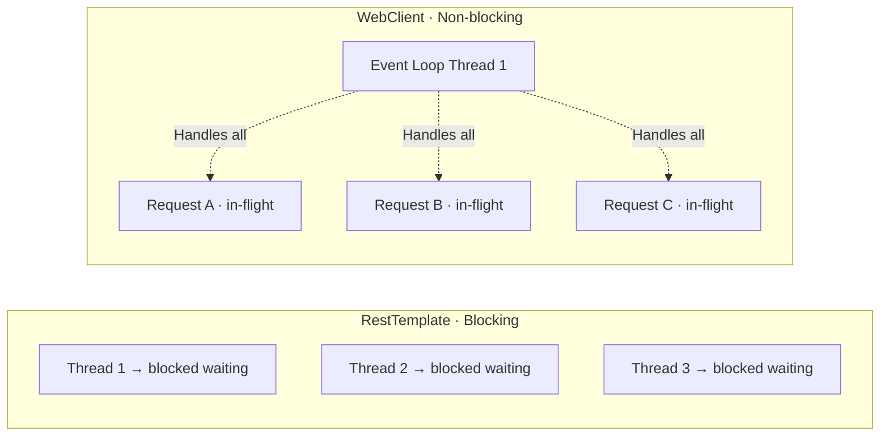
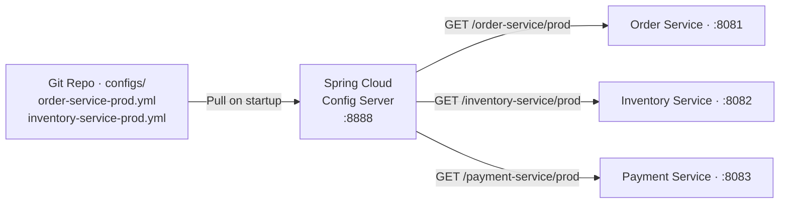

# Spring Cloud & Frameworks — Architect-Level Interview Guide

> **Target:** Senior Engineer · Engineering Lead · Pre-Architect
> **Focus:** Spring Boot, Feign, WebClient, Spring Cloud Config, Actuator

---

## Q: Why is RestTemplate deprecated? How does WebClient differ?

*Why interviewers ask this:* Tests understanding of reactive programming, blocking vs non-blocking I/O, and why this matters at scale.

### Answer

**RestTemplate** — synchronous, blocking. Each HTTP call blocks its thread until a response arrives. Under high load this exhausts the thread pool.

**WebClient** — asynchronous, non-blocking. Based on Project Reactor. A small number of threads handle thousands of concurrent requests using event-loop I/O.

**Comparison:**

| | RestTemplate | WebClient |
|--|-------------|-----------|
| I/O Model | Blocking | Non-blocking |
| Threading | 1 thread per request | Event-loop threads |
| Concurrency at scale | Poor (thread exhaustion) | Excellent |
| Reactive streams | ❌ | ✅ |
| Error handling | Try/catch | `.onErrorResume()` |
| Streaming responses | ❌ | ✅ |
| Status | Deprecated (Spring 6) | Recommended |

**RestTemplate (avoid):**
```java
// Blocks the calling thread until response arrives
ResponseEntity<Order> response = restTemplate.getForEntity(
    "http://order-service/orders/{id}", Order.class, orderId
);
```

**WebClient (recommended):**
```java
@Bean
public WebClient orderClient(WebClient.Builder builder) {
    return builder
        .baseUrl("http://order-service")
        .defaultHeader(HttpHeaders.CONTENT_TYPE, MediaType.APPLICATION_JSON_VALUE)
        .filter(ExchangeFilterFunctions.retry(3))
        .build();
}

// Non-blocking — returns Mono immediately, subscribes lazily
public Mono<Order> getOrder(String orderId) {
    return orderClient.get()
        .uri("/orders/{id}", orderId)
        .retrieve()
        .onStatus(HttpStatusCode::is5xxServerError, response ->
            Mono.error(new ServiceUnavailableException("order-service"))
        )
        .bodyToMono(Order.class)
        .timeout(Duration.ofSeconds(2))
        .onErrorReturn(Order.empty());
}
```



!!! tip "Architect Insight"
    If your entire stack is blocking (JPA, JDBC), switching to WebClient alone won't give you reactive benefits — the blocking DB call still ties up the thread. Consider R2DBC for fully reactive stacks, or keep RestTemplate in simple CRUD services. WebClient shines in I/O-heavy service aggregators and API gateways.

---

## Q: How do Feign clients simplify HTTP communication? What are the pitfalls?

### Answer

Feign generates HTTP client implementations from interface definitions, eliminating boilerplate.

**Setup:**
```java
@FeignClient(name = "inventory-service", fallback = InventoryFallback.class)
public interface InventoryClient {

    @GetMapping("/inventory/{productId}")
    InventoryResponse getInventory(@PathVariable String productId);

    @PostMapping("/inventory/reserve")
    ReservationResponse reserve(@RequestBody ReservationRequest request);
}
```

**Fallback implementation:**
```java
@Component
public class InventoryFallback implements InventoryClient {

    @Override
    public InventoryResponse getInventory(String productId) {
        return InventoryResponse.unavailable(productId);
    }

    @Override
    public ReservationResponse reserve(ReservationRequest request) {
        throw new ServiceUnavailableException("Inventory service down — cannot reserve");
    }
}
```

**Common pitfalls and fixes:**

| Pitfall | Problem | Fix |
|---------|---------|-----|
| No timeout configured | Hangs indefinitely if downstream is slow | Set `feign.client.config.default.connectTimeout` and `readTimeout` |
| No circuit breaker | Cascading failures when service is down | Enable `feign.circuitbreaker.enabled=true` + Resilience4j |
| Exception not mapped | HTTP errors silently swallowed | Implement `ErrorDecoder` to map HTTP status to exceptions |
| Retry on non-idempotent calls | Duplicate writes on POST retry | Configure retry only for `GET`; use idempotency keys for POST |
| Load balancer not active | Always hits same instance | Ensure `spring-cloud-starter-loadbalancer` is on classpath |

**Error decoder:**
```java
@Component
public class FeignErrorDecoder implements ErrorDecoder {

    @Override
    public Exception decode(String methodKey, Response response) {
        return switch (response.status()) {
            case 404 -> new ResourceNotFoundException("Not found: " + methodKey);
            case 503 -> new ServiceUnavailableException("Service unavailable: " + methodKey);
            default -> new Default().decode(methodKey, response);
        };
    }
}
```

---

## Q: How does Spring Cloud Config centralize configuration across microservices?

*Why interviewers ask this:* Configuration sprawl is a major operational issue at scale. Tests understanding of externalized configuration management.

### Answer

**Problem:** 50 services each have their own `application.yml` — different environments (dev, staging, prod) multiply this. How do you manage, audit, and update config safely?

**Solution:** Spring Cloud Config Server — single source of truth backed by Git.



**Config server setup:**
```java
@SpringBootApplication
@EnableConfigServer
public class ConfigServerApplication { }
```

```yaml
# Config server application.yml
spring:
  cloud:
    config:
      server:
        git:
          uri: https://github.com/myorg/microservices-config
          search-paths: '{application}'
          default-label: main
          clone-on-start: true
```

**Client service bootstrap:**
```yaml
# bootstrap.yml in each microservice
spring:
  application:
    name: order-service
  config:
    import: "configserver:http://config-server:8888"
  profiles:
    active: prod
```

**Dynamic refresh without restart:**
```java
@RefreshScope  // Bean is re-created on /actuator/refresh
@RestController
public class FeatureFlagController {

    @Value("${feature.new-checkout-flow:false}")
    private boolean newCheckoutFlow;
}
```

Then trigger: `POST /actuator/refresh` → or use Spring Cloud Bus (Kafka/RabbitMQ) to broadcast refresh to all instances simultaneously.

**Configuration hierarchy** (later overrides earlier):
```
application.yml → {app-name}.yml → {app-name}-{profile}.yml → environment vars
```

!!! warning "Security Note"
    Encrypt sensitive config values (DB passwords, API keys) in Git using Spring Cloud Config's symmetric or asymmetric encryption. Never commit plaintext secrets.

---

## Q: What are Spring Boot Actuator readiness and liveness probes? How do they work with Kubernetes?

### Answer

Kubernetes uses two probes to manage container lifecycle:

| Probe | Question | Action on failure |
|-------|---------|-------------------|
| **Liveness** | Is the app alive (not deadlocked)? | Kill and restart container |
| **Readiness** | Is the app ready to serve traffic? | Remove from load balancer pool |
| **Startup** | Has the app finished starting? | Block liveness/readiness until done |

**Spring Boot Actuator auto-exposes these:**
```yaml
management:
  endpoint:
    health:
      probes:
        enabled: true
      show-details: always
  health:
    livenessState:
      enabled: true
    readinessState:
      enabled: true
  endpoints:
    web:
      exposure:
        include: health,info,metrics,prometheus
```

Endpoints:
- `GET /actuator/health/liveness` → `{"status": "UP"}`
- `GET /actuator/health/readiness` → `{"status": "UP"}`

**Kubernetes deployment configuration:**
```yaml
apiVersion: apps/v1
kind: Deployment
metadata:
  name: order-service
spec:
  template:
    spec:
      containers:
        - name: order-service
          image: myrepo/order-service:1.2.0
          ports:
            - containerPort: 8080
          startupProbe:
            httpGet:
              path: /actuator/health/liveness
              port: 8080
            failureThreshold: 30      # Allow 60s to start (30 x 2s)
            periodSeconds: 2
          livenessProbe:
            httpGet:
              path: /actuator/health/liveness
              port: 8080
            initialDelaySeconds: 10
            periodSeconds: 10
            failureThreshold: 3       # Restart after 3 failures
          readinessProbe:
            httpGet:
              path: /actuator/health/readiness
              port: 8080
            initialDelaySeconds: 5
            periodSeconds: 5
            failureThreshold: 3       # Remove from pool after 3 failures
```

**Custom readiness indicator:**
```java
@Component
public class DatabaseReadinessIndicator implements HealthIndicator {

    private final DataSource dataSource;

    @Override
    public Health health() {
        try (Connection conn = dataSource.getConnection()) {
            conn.isValid(1);
            return Health.up().withDetail("db", "reachable").build();
        } catch (SQLException e) {
            return Health.down()
                .withDetail("db", "unreachable")
                .withException(e)
                .build();
        }
    }
}
```

!!! tip "Architect Insight"
    Set readiness to fail during rolling deployments until the new instance has warmed its caches and established DB connections. This prevents Kubernetes from routing traffic to instances that aren't truly ready, avoiding startup-time errors users see.

---

## Q: How do you manage configuration for a fleet of microservices across environments?

### Answer

**Strategy:**

1. **Externalize all config** — no hardcoded values in code; use environment variables or Config Server
2. **Layered config** — common defaults → service-specific → environment-specific
3. **Secret separation** — config in Git, secrets in Kubernetes Secrets or HashiCorp Vault
4. **Audit trail** — Git history gives full config change history with author and timestamp
5. **Dynamic refresh** — change config without redeployment using `@RefreshScope` + Spring Cloud Bus

**Tool comparison:**

| Tool                  | Best For                      | Trade-offs                                    |
|:----------------------|:------------------------------|:----------------------------------------------|
| Spring Cloud Config   | Spring-native, Git-backed     | Requires running config server                |
| Kubernetes ConfigMaps | K8s-native, simple values     | No encryption, no dynamic refresh             |
| Kubernetes Secrets    | Credentials in K8s            | Base64 only (not truly encrypted without KMS) |
| HashiCorp Vault       | Secrets with dynamic rotation | More complex setup                            |
| AWS Parameter Store   | AWS-native secrets            | Cloud vendor lock-in                          |

---

--8<-- "_abbreviations.md"

