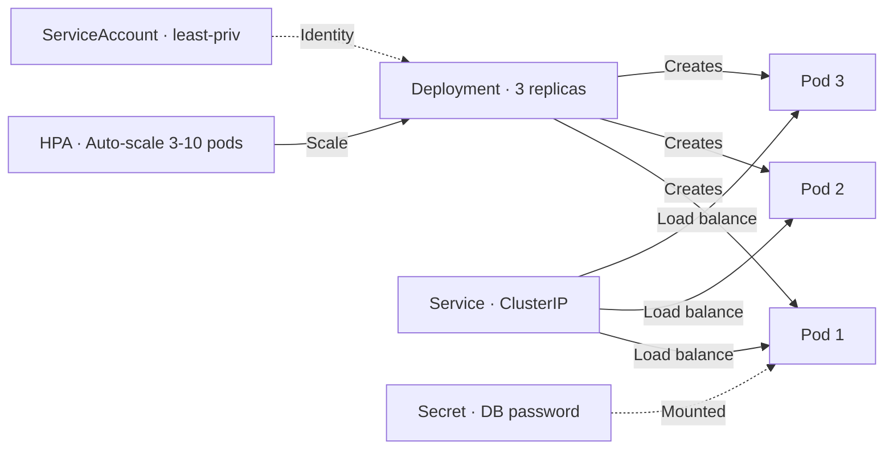
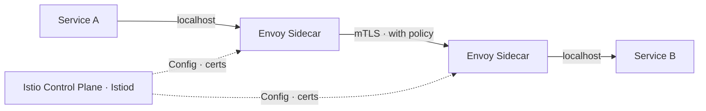

# Containers & Kubernetes — Architect-Level Interview Guide

> **Target:** Senior Engineer · Engineering Lead · Pre-Architect
> **Focus:** Docker, Kubernetes, probes, secrets management, service mesh

---

## Q: How do you containerize a Spring Boot application with Docker? What are best practices?

*Why interviewers ask this:* Image size, security, and layer caching directly impact build speed, deployment time, and attack surface.

### Answer

**Naive Dockerfile (avoid):**
```dockerfile
FROM openjdk:17
COPY target/app.jar app.jar
ENTRYPOINT ["java", "-jar", "app.jar"]
```
Problems: 600MB+ image, full JDK in production, rebuilds everything on any change.

**Best practice — multi-stage layered build:**
```dockerfile
# Stage 1: Extract Spring Boot layers
FROM eclipse-temurin:21-jre-alpine AS builder
WORKDIR /app
COPY target/app.jar app.jar
RUN java -Djarmode=layertools -jar app.jar extract

# Stage 2: Production image
FROM eclipse-temurin:21-jre-alpine
WORKDIR /app

# Run as non-root user
RUN addgroup -S appgroup && adduser -S appuser -G appgroup
USER appuser

# Copy layers — only app code changes frequently
COPY --from=builder /app/dependencies/          ./
COPY --from=builder /app/spring-boot-loader/    ./
COPY --from=builder /app/snapshot-dependencies/ ./
COPY --from=builder /app/application/           ./

EXPOSE 8080

# Use exec form to receive signals correctly (graceful shutdown)
ENTRYPOINT ["java", \
    "-XX:MaxRAMPercentage=75.0", \
    "-XX:+UseContainerSupport", \
    "org.springframework.boot.loader.launch.JarLauncher"]
```

**Why layers matter:** Docker caches each layer. If only application code changes, the `dependencies` layer (unchanged) is reused — build goes from 3 min to 15 sec.

**Layer rebuild frequency:**

```
dependencies/        ← Rarely changes → cached aggressively
spring-boot-loader/  ← Rarely changes → cached
snapshot-dependencies/ ← Sometimes
application/         ← Every commit → always rebuilt
```

**Image best practices:**

| Practice | Why |
|----------|-----|
| Use `alpine` or `distroless` base | Smaller attack surface, smaller image |
| Non-root user | Limits damage if container is compromised |
| No JDK in production | JRE only — `eclipse-temurin:21-jre` |
| Pin image tags | `eclipse-temurin:21.0.3_9-jre-alpine` not `latest` |
| Scan image for CVEs | Use `docker scout`, Trivy, or Snyk in CI |
| Set memory limits | `-XX:MaxRAMPercentage=75.0` respects container limits |

---

## Q: Describe the key components of a Kubernetes deployment for a Java microservice.

### Answer

**Complete production-ready deployment:**

```yaml
apiVersion: apps/v1
kind: Deployment
metadata:
  name: order-service
  namespace: production
  labels:
    app: order-service
    version: "1.2.0"
spec:
  replicas: 3
  selector:
    matchLabels:
      app: order-service
  strategy:
    type: RollingUpdate
    rollingUpdate:
      maxSurge: 1           # Allow 1 extra pod during update
      maxUnavailable: 0     # Never reduce below desired count
  template:
    metadata:
      labels:
        app: order-service
    spec:
      serviceAccountName: order-service-sa   # Least privilege SA
      containers:

        - name: order-service
          image: myrepo/order-service:1.2.0
          ports:

            - containerPort: 8080
          env:

            - name: SPRING_PROFILES_ACTIVE
              value: "prod"

            - name: DB_PASSWORD
              valueFrom:
                secretKeyRef:
                  name: order-db-secret
                  key: password
          resources:
            requests:
              memory: "256Mi"   # Guaranteed allocation
              cpu: "250m"
            limits:
              memory: "512Mi"   # OOM kill threshold
              cpu: "500m"
          startupProbe:
            httpGet:
              path: /actuator/health/liveness
              port: 8080
            failureThreshold: 30
            periodSeconds: 2
          livenessProbe:
            httpGet:
              path: /actuator/health/liveness
              port: 8080
            periodSeconds: 10
            failureThreshold: 3
          readinessProbe:
            httpGet:
              path: /actuator/health/readiness
              port: 8080
            periodSeconds: 5
            failureThreshold: 3
---
apiVersion: v1
kind: Service
metadata:
  name: order-service
  namespace: production
spec:
  selector:
    app: order-service
  ports:

    - port: 80
      targetPort: 8080
  type: ClusterIP
---
apiVersion: autoscaling/v2
kind: HorizontalPodAutoscaler
metadata:
  name: order-service-hpa
  namespace: production
spec:
  scaleTargetRef:
    apiVersion: apps/v1
    kind: Deployment
    name: order-service
  minReplicas: 3
  maxReplicas: 10
  metrics:

    - type: Resource
      resource:
        name: cpu
        target:
          type: Utilization
          averageUtilization: 70
```

**Key components explained:**



!!! tip "Architect Insight"
    Always set both `requests` and `limits`. Without `requests`, the scheduler can't place pods correctly. Without `limits`, one runaway pod can starve other services on the node. Set `memory limit = 2x request` and `cpu limit = 2x request` as a starting point.

---

## Q: How do you securely manage secrets in Kubernetes?

*Why interviewers ask this:* Secret sprawl is a compliance and security nightmare. Tests understanding of secret lifecycle management.

### Answer

**Kubernetes Secrets (built-in) — limitations:**

- Base64 encoded, not encrypted at rest by default
- Visible to anyone with cluster access
- No rotation, no audit trail

**Better approaches:**

**1. Kubernetes + Sealed Secrets (GitOps-safe):**
```bash
# Encrypt secret for Git storage
kubeseal --scope namespace-wide -o yaml < secret.yaml > sealed-secret.yaml
# Sealed secret committed to Git — only the controller in cluster can decrypt
```

**2. HashiCorp Vault + Vault Agent Injector:**
```yaml
# Pod annotation — Vault injects secrets as files
metadata:
  annotations:
    vault.hashicorp.com/agent-inject: "true"
    vault.hashicorp.com/role: "order-service"
    vault.hashicorp.com/agent-inject-secret-db: "secret/data/order-service/db"
    vault.hashicorp.com/agent-inject-template-db: |
      {{- with secret "secret/data/order-service/db" -}}
      spring.datasource.password={{ .Data.data.password }}
      {{- end -}}
```

**3. External Secrets Operator (AWS, GCP, Azure):**
```yaml
apiVersion: external-secrets.io/v1beta1
kind: ExternalSecret
metadata:
  name: order-db-secret
spec:
  refreshInterval: 1h
  secretStoreRef:
    name: aws-secrets-manager
    kind: ClusterSecretStore
  target:
    name: order-db-secret   # Creates K8s Secret
  data:

    - secretKey: password
      remoteRef:
        key: prod/order-service/db
        property: password
```

**Comparison:**

| Approach | Encryption at rest | Rotation | Audit log | Complexity |
|----------|-------------------|----------|-----------|------------|
| Plain K8s Secret | ❌ (unless KMS) | Manual | ❌ | Low |
| Sealed Secrets | ✅ | Manual | ❌ | Medium |
| Vault | ✅ | ✅ Auto | ✅ | High |
| External Secrets | ✅ (cloud KMS) | ✅ Auto | ✅ (cloud) | Medium |

!!! warning "Common Mistake"
    Never use environment variables for secrets in Kubernetes. They're visible in `kubectl describe pod`, process listings, and crash dumps. Mount secrets as files with restrictive permissions (`0400`) and read them at startup.

---

## Q: What are the best practices for container networking in microservices?

### Answer

**Network policy — default deny everything, allow explicitly:**
```yaml
apiVersion: networking.k8s.io/v1
kind: NetworkPolicy
metadata:
  name: order-service-netpol
  namespace: production
spec:
  podSelector:
    matchLabels:
      app: order-service
  policyTypes:

    - Ingress
    - Egress
  ingress:

    - from:
        - podSelector:
            matchLabels:
              app: api-gateway   # Only gateway can call order-service
      ports:

        - port: 8080
  egress:

    - to:
        - podSelector:
            matchLabels:
              app: inventory-service  # order-service can call inventory
      ports:

        - port: 8080
    - to:   # Allow DNS
        - namespaceSelector: {}
      ports:

        - port: 53
          protocol: UDP
```

**Key networking concepts for microservices:**

| Concept | Implementation | Purpose |
|---------|---------------|---------|
| Service discovery | Kubernetes DNS (`order-service.production.svc`) | Find services by name |
| Load balancing | Kubernetes Service (`ClusterIP`) | Distribute traffic across pods |
| Ingress | NGINX Ingress / Istio Gateway | External traffic → cluster |
| mTLS | Istio / Linkerd | Encrypt and authenticate service-to-service |
| Network isolation | NetworkPolicy | Prevent lateral movement |

---

## Q: What is a service mesh? When should you use one?

### Answer

A service mesh is an infrastructure layer that handles service-to-service communication, providing:

- **Traffic management** — retries, circuit breaking, timeouts, traffic splitting
- **Observability** — automatic distributed tracing, metrics per service pair
- **Security** — mTLS between all services, certificate rotation
- **Policy enforcement** — rate limiting, authorization policies

**Without service mesh:** Each microservice implements these itself (Resilience4j, Spring Cloud).
**With service mesh:** Handled by sidecar proxy (Envoy) — zero code changes needed.



**When to use a service mesh:**

✅ Use when:

- You have 10+ services and maintaining resilience code in each is costly
- You need zero-trust security (mTLS everywhere) as a compliance requirement
- You need fine-grained traffic control (canary per service pair, fault injection for testing)
- You want automatic observability without code instrumentation

❌ Skip when:

- Small service count (< 10) — operational overhead outweighs benefits
- Team unfamiliar with service mesh — steep learning curve (Istio especially)
- Simple deployments — start with library-based resilience (Resilience4j) first

---

--8<-- "_abbreviations.md"

