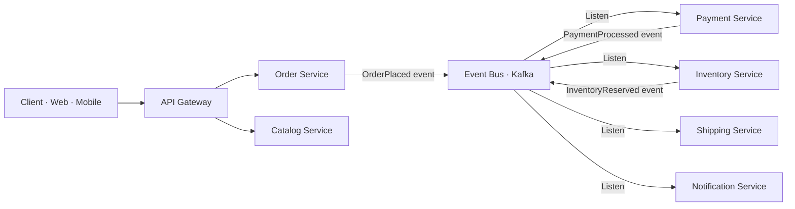
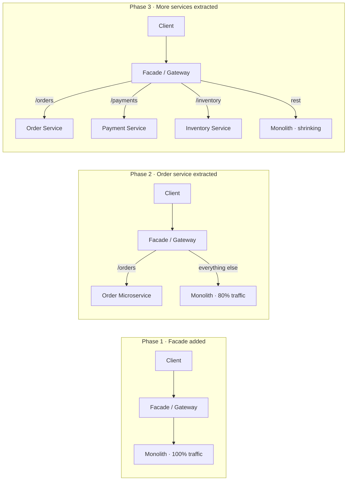
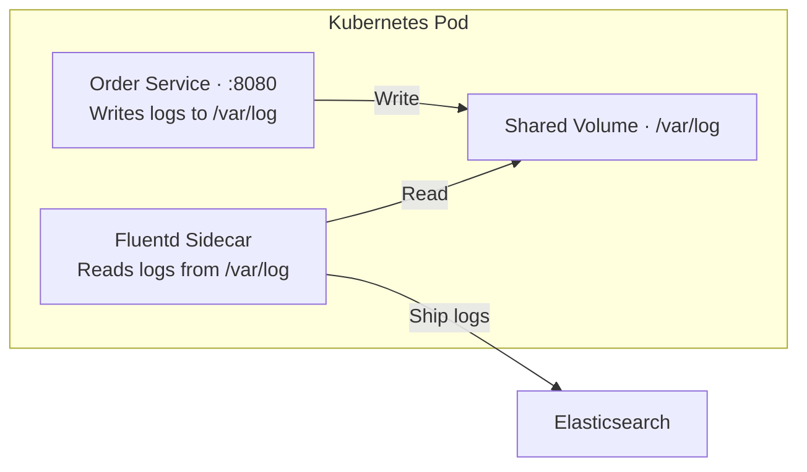
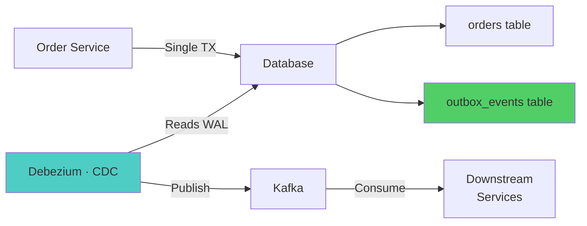
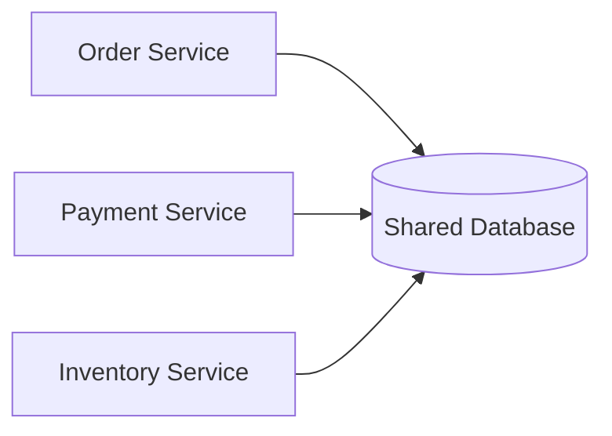
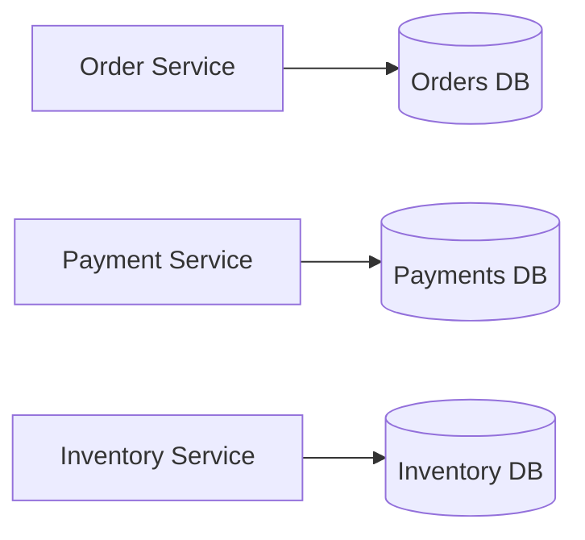

# Architecture Patterns — Architect-Level Interview Guide

> **Target:** Senior Engineer · Engineering Lead · Pre-Architect
> **Focus:** Strangler Fig, BFF, Sidecar, Transactional Outbox, DDD Decomposition

---

## Q: How do you decompose a large e-commerce monolith into microservices using DDD?

*Why interviewers ask this:* This is the most common real-world scenario. Tests strategic thinking, understanding of domain modeling, and ability to drive a migration plan.

### Answer

**Step 1 — Event Storming to find domain events:**
Run a collaborative session with domain experts. Map out all business events on a timeline:

```
OrderPlaced → PaymentProcessed → InventoryReserved → OrderShipped → OrderDelivered
                                       ↓
                               InventoryInsufficient → OrderCancelled → PaymentRefunded
```

**Step 2 — Identify Bounded Contexts (service boundaries):**

| Bounded Context | Responsibilities | Key Entities |
|----------------|-----------------|--------------|
| **Order Context** | Create, track, cancel orders | Order, LineItem, OrderStatus |
| **Payment Context** | Process payments, refunds | Payment, Transaction, Refund |
| **Inventory Context** | Stock levels, reservations | Product, Stock, Reservation |
| **Shipping Context** | Fulfillment, tracking | Shipment, Carrier, TrackingEvent |
| **Catalog Context** | Product info, pricing | Product, Category, Price |
| **Customer Context** | Profile, addresses, loyalty | Customer, Address, LoyaltyAccount |
| **Notification Context** | Email, SMS, push | Notification, Template, Channel |

**Step 3 — Define anti-corruption layers between contexts:**
```
Order Context → [ACL] → Inventory Context
                         (Order uses "InventoryItem" not Inventory's "SKU" internally)
```

**Step 4 — Context Map:**



**Step 5 — Apply Strangler Fig for migration** (never big-bang):
1. Put a proxy (API Gateway / facade) in front of the monolith
2. Route one domain at a time to the new microservice
3. Old monolith serves everything else unchanged
4. Repeat until monolith is empty

!!! tip "Architect Insight"
    Don't decompose by technical layer (service layer, repository, controller). Decompose by **business capability**. The rule of thumb: a microservice should be deployable independently by one team without coordinating with other teams. If you're always deploying services together, your boundaries are wrong.

---

## Q: What is the Strangler Fig Pattern? Walk me through applying it.

*Why interviewers ask this:* Big-bang rewrites almost always fail. Strangler Fig is the safe alternative — tests real-world pragmatism.

### Answer

Named after the Strangler Fig tree which grows around a host tree, eventually replacing it.

**The pattern:**
1. Deploy a routing layer (facade) in front of the monolith
2. Incrementally build new microservices for specific capabilities
3. Redirect traffic for those capabilities to the new service
4. Remove the equivalent code from the monolith
5. Repeat until the monolith is gone

**Implementation stages:**



**Key rules:**
- **Never break the API contract** for clients during migration
- **Migrate data ownership** along with the service — each service gets its own schema
- **Use dual writes** during transition: write to both old and new until cutover
- **Start with the least risky domain** (e.g., notifications, not payments)

---

## Q: What is the Sidecar Pattern? When would you use it?

### Answer

The sidecar runs as a companion container in the same pod as the main service, handling cross-cutting concerns without touching the service's code.

**Common sidecar use cases:**

| Sidecar | What it does | Example |
|---------|-------------|---------|
| Proxy / Service mesh | mTLS, retries, circuit breaker | Envoy (Istio) |
| Log shipper | Collect and forward logs | Filebeat, Fluentd |
| Config reloader | Watch and reload config changes | ConfigMap reloader |
| Secret injector | Inject secrets from Vault | Vault agent |
| Metrics exporter | Expose JVM/app metrics | Prometheus JMX exporter |

**Kubernetes pod with log shipper sidecar:**
```yaml
spec:
  containers:
    - name: order-service          # Main container
      image: myrepo/order-service:1.2.0
      volumeMounts:
        - name: logs
          mountPath: /var/log/app

    - name: log-shipper            # Sidecar container
      image: fluent/fluentd:v1.16
      volumeMounts:
        - name: logs
          mountPath: /var/log/app  # Shared volume — reads service logs
      env:
        - name: ELASTICSEARCH_HOST
          value: "elasticsearch:9200"

  volumes:
    - name: logs
      emptyDir: {}                 # Shared between main + sidecar
```



!!! tip "Architect Insight"
    The sidecar pattern is powerful because it enforces **separation of concerns** at the infrastructure level, not in code. If you use Istio, the Envoy sidecar provides retry, circuit breaking, mTLS, and distributed tracing automatically — your service code has zero awareness. This is the ideal architecture for platform teams to provide cross-cutting concerns to application teams.

---

## Q: What is the Transactional Outbox Pattern? Why is it critical for event-driven systems?

*Why interviewers ask this:* This is a senior/architect-level question about the dual-write problem — a subtle but critical correctness issue.

### Answer

**The problem — dual write:**
```java
// This looks correct but has a fatal flaw:
@Transactional
public void placeOrder(Order order) {
    orderRepository.save(order);          // Step 1: Save to DB
    kafkaTemplate.send("orders", event);  // Step 2: Publish to Kafka
}
// If Kafka fails AFTER the DB commit → order saved but event never published
// If app crashes between steps → same problem
// Result: inconsistent state — order exists but downstream never notified
```

**Solution — Transactional Outbox:**
Write the event to an `outbox` table **in the same DB transaction** as the business entity. A separate process reads the outbox and publishes to Kafka.

```java
@Transactional
public void placeOrder(Order order) {
    orderRepository.save(order);

    // Same transaction — atomic!
    OutboxEvent event = new OutboxEvent(
        order.getId(), "OrderPlaced", serialize(order), Instant.now()
    );
    outboxRepository.save(event);   // Write to DB, not Kafka
}
```

**Outbox table schema:**
```sql
CREATE TABLE outbox_events (
    id          UUID PRIMARY KEY DEFAULT gen_random_uuid(),
    aggregate_id VARCHAR(255) NOT NULL,
    event_type   VARCHAR(255) NOT NULL,
    payload      JSONB NOT NULL,
    created_at   TIMESTAMP NOT NULL,
    published_at TIMESTAMP          -- NULL = not yet published
);
```

**Publisher process (two options):**

| Option | How | Tool |
|--------|-----|------|
| Polling publisher | SELECT unpublished rows, publish, mark published | Quartz scheduler |
| CDC publisher | Tail DB transaction log (binlog/WAL) | Debezium + Kafka Connect |



**Guarantees:**
- ✅ At-least-once delivery (consumer must be idempotent)
- ✅ No event loss even if Kafka or app crashes
- ✅ Order of events preserved per aggregate

!!! warning "Important"
    The outbox pattern gives **at-least-once** delivery, not exactly-once. Consumers must handle duplicate events using idempotency keys. This is expected and acceptable.

---

## Q: Compare Shared Database vs Database-per-Service. What are the trade-offs?

### Answer

**Shared Database:**


**Database-per-Service:**


**Trade-off comparison:**

| Concern | Shared DB | DB-per-Service |
|---------|-----------|---------------|
| Data consistency | Easy — ACID joins | Hard — eventual consistency |
| Coupling | High — schema changes break everyone | Low — independent evolution |
| Operational cost | Low — one DB | High — N databases |
| Scalability | Hard — shared resource | Independent scaling per service |
| Autonomy | None — shared schema ownership | Full — team owns their schema |
| Query complexity | Simple JOINs | API composition or CQRS |
| Migration complexity | Low | High |

**When to use shared DB:** Migrating from monolith (transitional), very small teams, tight consistency requirements without event sourcing capability.

**When to use DB-per-Service:** Mature microservices teams, independent deployment required, services at different scale needs, long-term maintainability.

!!! tip "Architect Insight"
    The biggest mistake teams make is sharing a database but calling it microservices. If services share a DB schema, they're still tightly coupled — deploying one service can break another via a schema change. True microservices independence requires database-per-service, even if it adds operational complexity.

---

--8<-- "_abbreviations.md"

