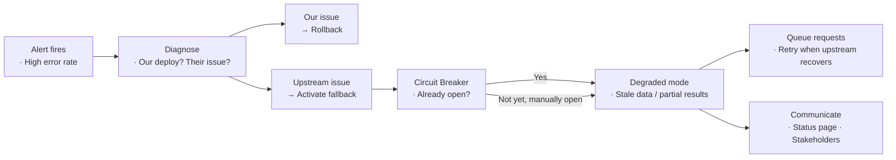

# CI/CD & Team Leadership — Architect-Level Interview Guide

> **Target:** Senior Engineer · Engineering Lead · Pre-Architect
> **Focus:** CI/CD pipelines, monolith migration, team dynamics, production incidents

---

## Q: Design a CI/CD pipeline for a Spring Boot microservice. Walk me through the stages.

*Why interviewers ask this:* Tests real-world delivery experience — not just "do you know CI/CD" but can you design a production-grade pipeline.

### Answer

**Pipeline stages:**

```mermaid
graph LR
    Commit["Git Push\n· Feature branch"]
    Build["Build\n· mvn compile\n· mvn test"]
    Quality["Quality Gate\n· SonarQube\n· Coverage > 80%"]
    Docker["Container Build\n· docker build\n· Trivy scan"]
    IntTest["Integration Tests\n· Testcontainers\n· API contract tests"]
    Staging["Deploy Staging\n· Helm upgrade\n· Smoke tests"]
    Approval["Manual Approval\n· Team lead\n· Or auto if < N%"]
    Prod["Deploy Prod\n· Canary 10%\n· Promote to 100%"]
    Rollback["Rollback\n· Auto on error rate"]

    Commit --> Build
    Build -->|Tests pass| Quality
    Quality -->|Gate pass| Docker
    Docker -->|No CVEs| IntTest
    IntTest -->|Pass| Staging
    Staging -->|Smoke pass| Approval
    Approval -->|Approved| Prod
    Prod -->|Error rate high| Rollback

    style Rollback fill:#ff6b6b
    style Prod fill:#51cf66
```



**Jenkins pipeline (Jenkinsfile):**
```groovy
pipeline {
    agent any
    environment {
        IMAGE = "myrepo/order-service"
        VERSION = "${env.GIT_COMMIT[0..7]}"
    }
    stages {
        stage('Build & Unit Test') {
            steps {
                sh 'mvn clean verify -Dskip.integration=true'
                junit 'target/surefire-reports/*.xml'
                jacoco minimumLineCoverage: '80'
            }
        }
        stage('Code Quality') {
            steps {
                withSonarQubeEnv('SonarCloud') {
                    sh 'mvn sonar:sonar'
                }
                timeout(time: 5, unit: 'MINUTES') {
                    waitForQualityGate abortPipeline: true
                }
            }
        }
        stage('Build & Scan Image') {
            steps {
                sh "docker build -t ${IMAGE}:${VERSION} ."
                sh "trivy image --exit-code 1 --severity HIGH,CRITICAL ${IMAGE}:${VERSION}"
                sh "docker push ${IMAGE}:${VERSION}"
            }
        }
        stage('Integration Tests') {
            steps {
                // Testcontainers spins up real DB, Kafka, etc.
                sh 'mvn verify -P integration-tests'
            }
        }
        stage('Deploy to Staging') {
            steps {
                sh """
                    helm upgrade --install order-service ./helm/order-service \
                        --namespace staging \
                        --set image.tag=${VERSION} \
                        --wait --timeout 5m
                """
                // Run smoke tests
                sh 'newman run api-tests/smoke.postman_collection.json'
            }
        }
        stage('Deploy to Production — Canary') {
            when { branch 'main' }
            steps {
                input message: 'Deploy to production?', ok: 'Deploy'
                sh """
                    helm upgrade order-service ./helm/order-service \
                        --namespace production \
                        --set image.tag=${VERSION} \
                        --set canary.enabled=true \
                        --set canary.weight=10
                """
                // Monitor for 10 minutes, then promote or rollback
                sh './scripts/canary-monitor.sh --threshold-error-rate=1 --duration=10m'
            }
        }
    }
    post {
        failure { slackSend channel: '#deployments', message: "❌ Pipeline failed: ${env.JOB_NAME} ${VERSION}" }
        success { slackSend channel: '#deployments', message: "✅ Deployed: ${env.JOB_NAME} ${VERSION}" }
    }
}
```

**Key principles:**

| Principle | Implementation |
|-----------|---------------|
| Fail fast | Unit tests first, before expensive stages |
| Immutable artifacts | Image tag = git commit SHA, never `latest` |
| Security scanning | CVE scan before pushing to registry |
| Contract testing | Verify producer/consumer compatibility (Pact) |
| Progressive delivery | Canary → monitor → promote or rollback |
| Audit trail | Every deployment linked to git commit + who approved |

---

## Q: How do you handle an outage in an upstream service your team doesn't own?

*Why interviewers ask this:* Tests maturity, communication skills, system thinking, and ownership mindset.

### Answer

**Immediate actions (first 15 minutes):**

1. **Detect** — alert fires, or user report. Open incident channel immediately.
2. **Assess blast radius** — which of our user journeys are affected?
3. **Activate fallback** — circuit breaker should already be tripping. Confirm it is.
4. **Verify it's not us** — check our own error rates, deployments in last 2 hours.
5. **Contact their on-call** — check their status page, open a P1 with their team.
6. **Communicate to stakeholders** — brief, factual update every 15 minutes.

**Technical response:**



**Degradation strategies by service type:**

| Upstream service | Fallback strategy |
|-----------------|------------------|
| Product catalog | Serve stale cached data (Redis, CDN) |
| Payment service | Queue orders, notify user of delayed processing |
| Recommendation engine | Return empty/default recommendations |
| User profile | Use cached profile; disable personalized features |
| Search service | Fall back to simple DB query |

**Post-incident:**
- Root cause analysis within 48 hours
- Add new observability: can we detect their degradation faster?
- Review SLA: do we have contractual protection?
- Consider adding a local cache/replica to reduce dependency

!!! tip "Architect Insight"
    The best engineers design systems that are resilient to upstream failures **before** they happen. If your system goes down whenever an upstream service does, the dependency is too tight. Ask: "If this service is down for 4 hours, what can we still do?" Design and implement that answer proactively.

---

## Q: How do you onboard new engineers to a complex microservices system?

### Answer

**The problem:** New engineers face an overwhelming number of services, repositories, conventions, and tools. A bad onboarding experience adds months to productivity.

**A structured 30-60-90 day approach:**

**Week 1 — Read the docs, run the system locally:**
- Maintain a `ARCHITECTURE.md` in the root repo: service map, team ownership, runbooks
- Provide a `docker-compose.yml` that spins up the full system locally
- Document the "golden path" — the simplest feature end-to-end

**Week 2-3 — Guided contribution:**
- Assign a simple bug fix or small feature in a well-understood service
- Pair programming sessions to explain conventions
- Code review every PR with detailed explanations (not just "LGTM")

**30 days — Unguided contribution:**
- Own a small feature from design to deployment
- On-call shadow (observe, don't handle)

**60 days — Production ownership:**
- Primary on-call for one service
- Conduct a postmortem and present findings

**Key artifacts to maintain:**

| Document | Contents |
|----------|---------|
| `ARCHITECTURE.md` | Service map, team ownership, key tech choices |
| Service README | What it does, how to run, how to test, common issues |
| Runbook | How to diagnose and fix common alerts |
| ADR (Architecture Decision Records) | Why key decisions were made |
| API contracts | OpenAPI specs, event schemas |

---

## Q: How do you prioritize fixing tech debt in a live microservices ecosystem?

### Answer

**Tech debt is not all equal.** Categorize before prioritizing:

| Debt Type | Risk | Priority | Examples |
|-----------|------|----------|---------|
| Security vulnerabilities | 🔴 Critical | Fix immediately | CVEs, hardcoded secrets |
| Reliability debt | 🔴 High | Fix next sprint | No circuit breakers, no health checks |
| Scalability debt | 🟡 Medium | Plan this quarter | Synchronous chains, shared DB |
| Code quality debt | 🟢 Low | Continuous improvement | Duplication, poor naming |
| Documentation debt | 🟢 Low | Continuous | Missing runbooks, stale docs |

**Framework — Tech Debt Backlog Scoring:**

```
Priority Score = Impact × Likelihood × Effort_Inverse

Impact (1-5):     How much does this hurt users or on-call?
Likelihood (1-5): How often does it cause problems?
Effort_Inverse:   5=quick fix, 1=months of work
```

**Structural approach:**

1. **Make it visible** — add tech debt to the backlog, not a separate "debt board" that gets ignored
2. **20% rule** — reserve 20% of every sprint for tech debt (non-negotiable)
3. **Boy Scout Rule** — leave code cleaner than you found it (refactor during feature work)
4. **Seize migration opportunities** — when touching a module for a feature, refactor the surrounding debt
5. **Track debt metrics** — SonarQube quality gate, test coverage trend, build time trend

**What NOT to do:**
- ❌ "Debt sprint" — batching all debt into one sprint that never happens
- ❌ Letting security CVEs sit in the backlog with low priority
- ❌ Measuring debt by number of TODO comments (meaningless)

---

## Q: How do you balance team autonomy with architectural consistency?

### Answer

This is one of the core tensions in microservices organizations.

**Too much autonomy:**
- Every service uses a different tech stack
- No shared observability → debugging becomes a nightmare
- Duplicated solutions to the same problems
- New engineers lost — nothing is familiar

**Too much control:**
- Slows down teams, creates bottlenecks at architecture review board
- One-size-fits-all decisions that don't fit some teams
- "Platform team" becomes a blocker

**The solution — Paved Roads + Golden Paths:**

Define **what teams must do** (non-negotiable standards) vs **what teams choose** (autonomous decisions):

| Must Do (Non-negotiable) | Can Choose (Autonomous) |
|--------------------------|------------------------|
| Emit structured logs to centralized system | Log framework (Logback, Log4j2) |
| Expose `/actuator/health` endpoints | Framework (Spring Boot, Quarkus, Micronaut) |
| Use approved container base images | Internal framework version |
| Follow API contract versioning rules | API design style |
| Pass security scanning in CI | Test framework |
| Use approved message broker (Kafka) | Message serialization format |

**Architecture Decision Records (ADRs):**
Document every architectural decision with context, decision, and consequences. Stored in Git. Teams can propose ADRs — the architecture guild approves.

```markdown
# ADR-012: All services must expose Prometheus metrics via Micrometer

## Status: Accepted

## Context
We cannot consistently monitor 30+ services without a standard metrics format.

## Decision
All services must include `micrometer-registry-prometheus` and expose
`/actuator/prometheus`. Teams choose their own dashboards.

## Consequences
+ Unified metrics in Grafana across all services
- Teams using non-Spring frameworks need equivalent setup
```

!!! tip "Architect Insight"
    The Platform Team's job is to make the right thing easy and the wrong thing hard. Build internal libraries, templates, and Helm charts that embed the standards. If the opinionated path is also the easiest path, teams will follow it naturally without enforcement.

---

--8<-- "_abbreviations.md"

